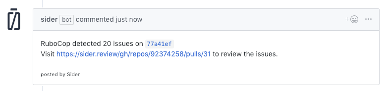
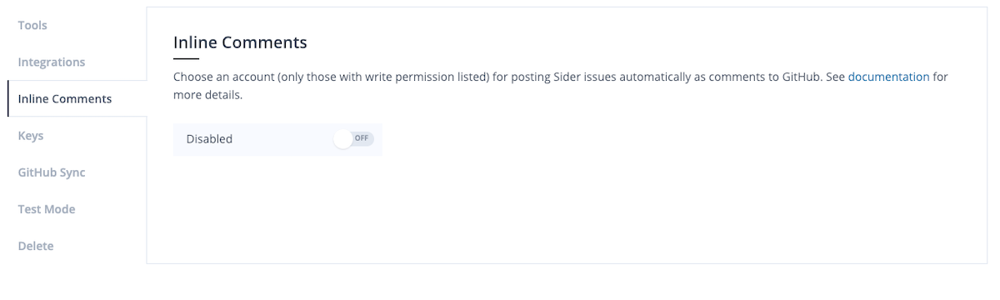

# Inline Comments

Sider provides an option to notify analysis results to GitHub as inline comments of pull requests. This option posts comments to each pull request when analyzers detect problems. It will allow you to see the analysis results without leaving your pull request pages.

If an analysis tool find more than 5 issues, a summary of the issues will be posted on your pull request page.

## Setting up

Choose an account on the repository settings page of Sider.

If you cannot find a user that you would like them to post comments, please make sure the following:

* The user is signed up to Sider.
* The user has write permission to the repository on GitHub.

You may need to click `Synchronize` button to let Sider refresh the organization data.

