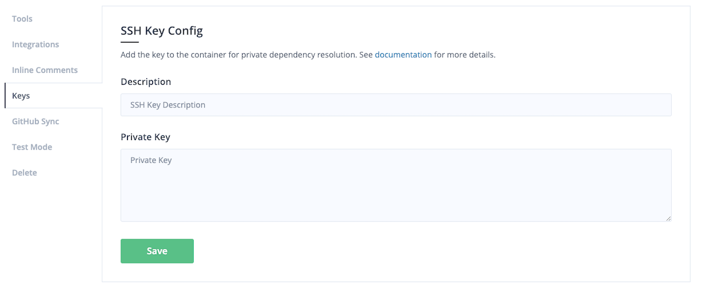

# Private Dependencies

Analyzing a private project sometimes need an access to another private repository. Your team might be using Git repository to distribute private library. This kind of dependency is supported in some tools including Bundler, npm, and Glide.

## Private Dependencies

We support using SSH to access private repository during an analysis session.

* You can specify your SSH private key for each project.
* During analysis session, `GIT_SSH` environment variable will be set so that your Git access will use that key.

## Uploading the SSH Key

1. Visit the repository setting.
2. Click *Add* button of *SSH Key Config* section.
3. Fill the text field with the content of key file.
4. You can specify the description of the SSH key.


Note that the private key cannot have a passphrase and must be an RSA key.


## Using SSH

Currently, only a few analysis tools use SSH configuration.

1. JavaScript tools use SSH via `npm install` to access private repository.
2. Go Meta Linter runs Glide to download dependencies from Git repository.

Other tools do not use SSH so adding SSH key for such tools are not needed at all.

