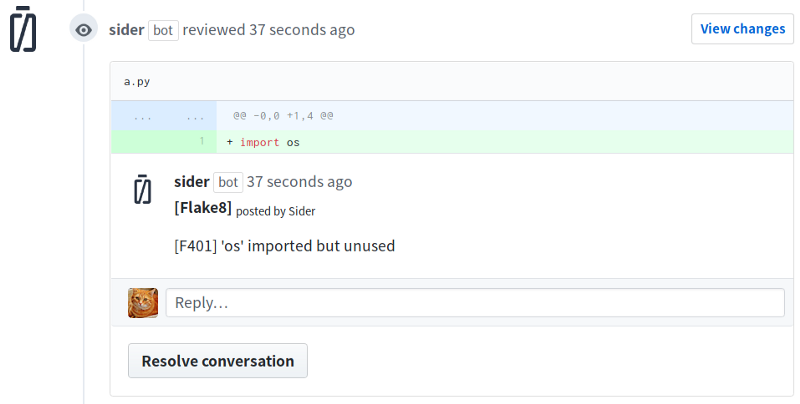

Sider provides an option to notify analysis results to GitHub as inline comments of pull requests. This option post comments to each pull request when analyzers detect problems. It will allow you to see the analysis results without leaving your pull request pages.

If an analysis tool finds more than 5 issues, a summary of the issues will be posted on your pull request page.

## Setting up


If the Test Mode section is set to `ON`, Sider will post comments to your pull request. Note that this interface requires Sider to be enable as a GitHub App.

