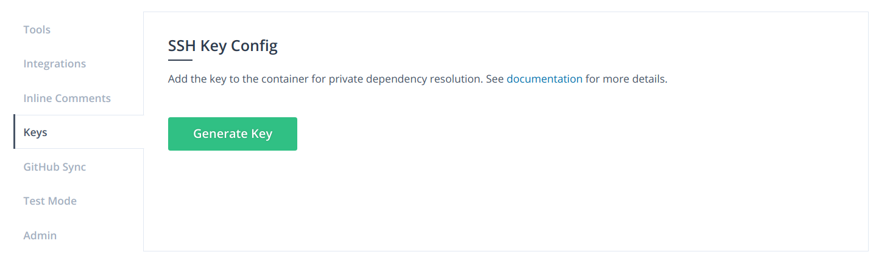
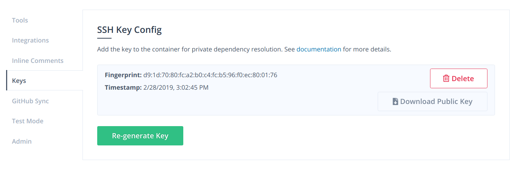

# Private Dependencies

Analyzing a private project sometimes needs access to another private repository. Your team might be using a Git repository to distribute a private library. This kind of dependency is supported in some tools including Bundler, npm.

We support using SSH to access a private repository during an analysis session.

## Generating an SSH private key

When you click the **"Generate Key"** button, Sider generates a 4096 bit RSA key used in analysis sessions automatically.

> We strongly recommend against adding secret keys to public repositories. Their analysis results are publicly accessible, and your secret keys might get exposed.

## Downloading the SSH public key

After generating, you can download the SSH public key used in analysis sessions from this page. The key is able to be added as [Deploy Keys](https://docs.github.com/en/free-pro-team@latest/developers/overview/managing-deploy-keys#deploy-keys) in GitHub.

> The SSH public key is supposed to be configured in another repository.
>
> For example, think about the case your repository _my-app_ depends on another private repository _my-lib_, which is hosted on GitHub.
> You should configure following the steps:
>
> 1. Access the repository settings page of _my-app_ on Sider.
> 2. Click **"Generate Key"**.
> 3. Click **"Download Public Key"**.
> 4. Access the repository settings page of _my-lib_ on GitHub.
> 5. Click **"Deploy keys"**.
> 6. Click **"Add deploy key"**.
> 7. Copy the downloaded public key and paste it in **"Key"** input form.
> 8. Click **"Add key"**.

## Using SSH

Currently, only a few analysis tools use an SSH configuration.

- All Ruby analyzers (Bundler)
- [ESLint](../tools/javascript/eslint.md) (npm)
- [TSLint](../tools/javascript/tslint.md) (npm)
- [CoffeeLint](../tools/javascript/coffeelint.md) (npm)
- [stylelint](../tools/css/stylelint.md) (npm)

Other tools do not use SSH, so adding an SSH key for such tools are not needed.
