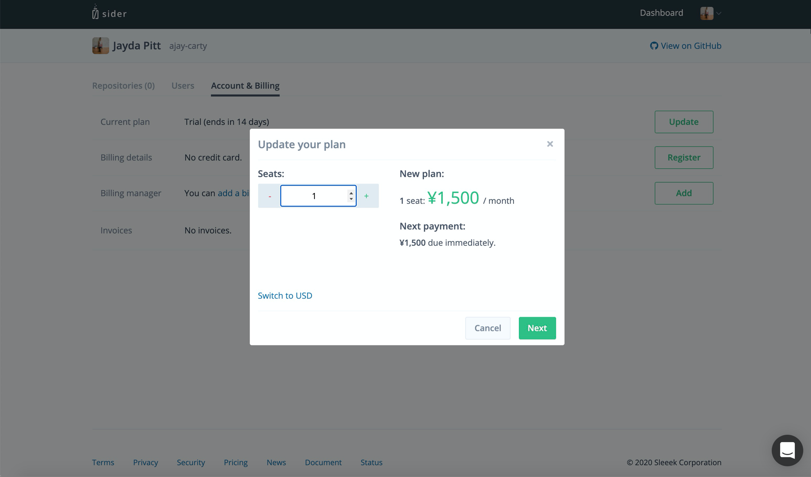
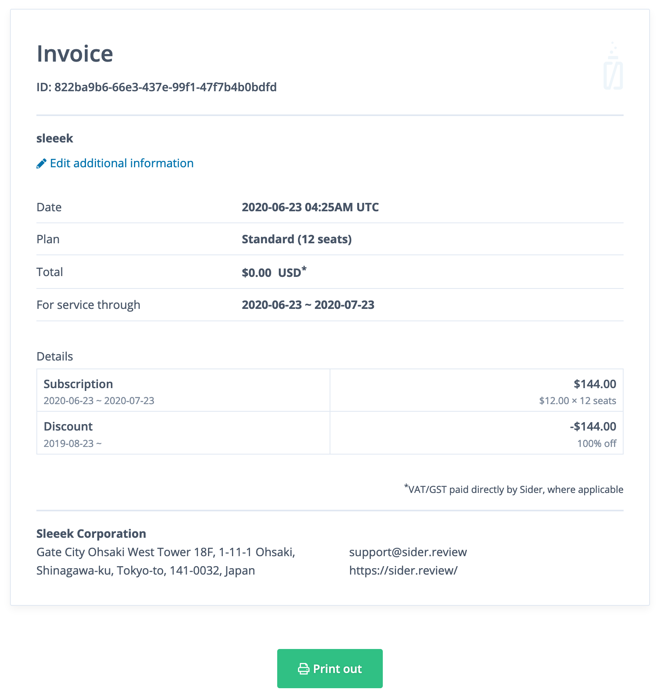
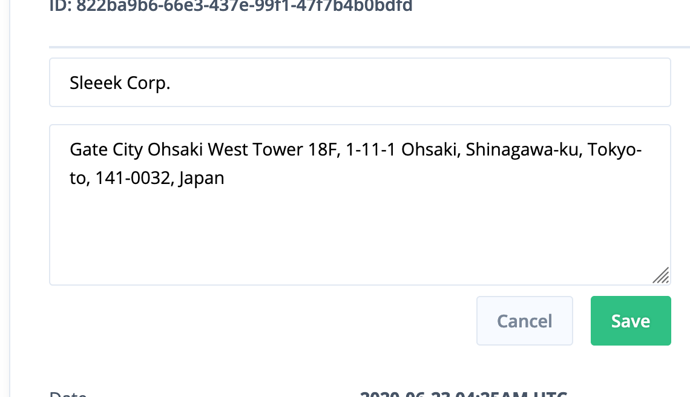
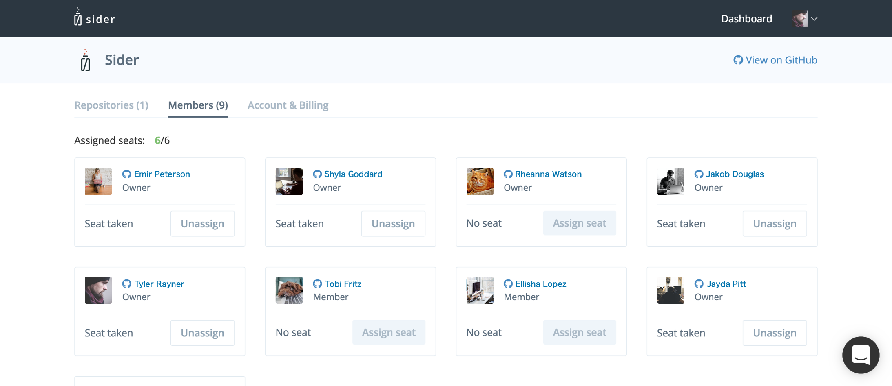

# Billing and Plans

## Sider Plans

Sider's plan depends on the number of users who are assigned seats. The seat-assigned users can check analysis results, close/reopen issues, post comments to the pull requests.

| Price                                         | Public Repositories | Private Repositories |
| :-------------------------------------------- | :-----------------: | :------------------: |
| \$12 USD/month (or ¥1,500 JPY/month) per seat |      Unlimited      |      Unlimited       |

You can upgrade the plan and increase/decrease seats in the organization settings page.

You must have the owner role for your organization if you would like to change organization settings or repository settings.

Additionally, we have prepared the 14-day trial plan. This trial plan will start when you add the first private repository and will allow you to try Sider without any limitations. And, private repositories will be no longer analyzed when the trial has been expired.

At this time, Sider will change your plan to the Free plan unless you update Sider's plan. The Free plan analyzes your public repositories, however, one doesn't analyze your private repositories.

## Education Plan

If you're a student, you can join the Education plan through [GitHub Student Developer Pack](https://education.github.com/pack) to use Sider for free.

The Education plan is only for the student's `individual organization(personal account)`. Make sure to select your GitHub individual organization when you use Sider with GitHub Student Developer Pack. If you select other repositories instead of your individual organization on Sider, We apply the Standard plan with 14 days trial to the repositories.

If you wish to apply an Education plan to your academic organizations (e.g., student organizations, course work, research groups, etc.), contact us via the chat button at the bottom right on Sider. We welcome requests from not only students but also faculty and staff.

## Billing

Sider uses [Stripe](https://stripe.com/) for payment. You can use either a credit card or a debit card. Please check our [pricing page](https://sider.review/pricing) to learn more details about billing.

## Invoice

You can confirm your invoice on the organization settings page.

You can check payment histories on the page. And also you can view details of invoice.

The page will tell you details of the invoice. Click **"Print out"**, then you will get the invoice as PDF to print.

You can include your company information, e.g. company name, postal code, address and so on.
Click **"Edit additional information"** on detailed invoice page, and fill in the information as necessary.

You must have the owner role for the organization to edit the invoice.

## Q&A

### How to assign seats?

You can assign seats for your teammates on the organization settings page. After buying seats, assign them to the teammates.

Click "Assign seat" with users that you would like to assign seats to use Sider.

### Where can I change plan?

You can change your plan in the organization settings page within [sider.review](https://sider.review/).

On this page, click `Update` and select the number of seats. Then you can check the billing preview. After click `Update` in the preview, your plan will be updated. Please note that you must be an admin role for your organization in order to change plans.

### We need invoices with the address of our company

You can add your address to the invoice. Click "Add additional information" link in the invoice details page; then you will see the text area. In the area, you can write the address or other information.
