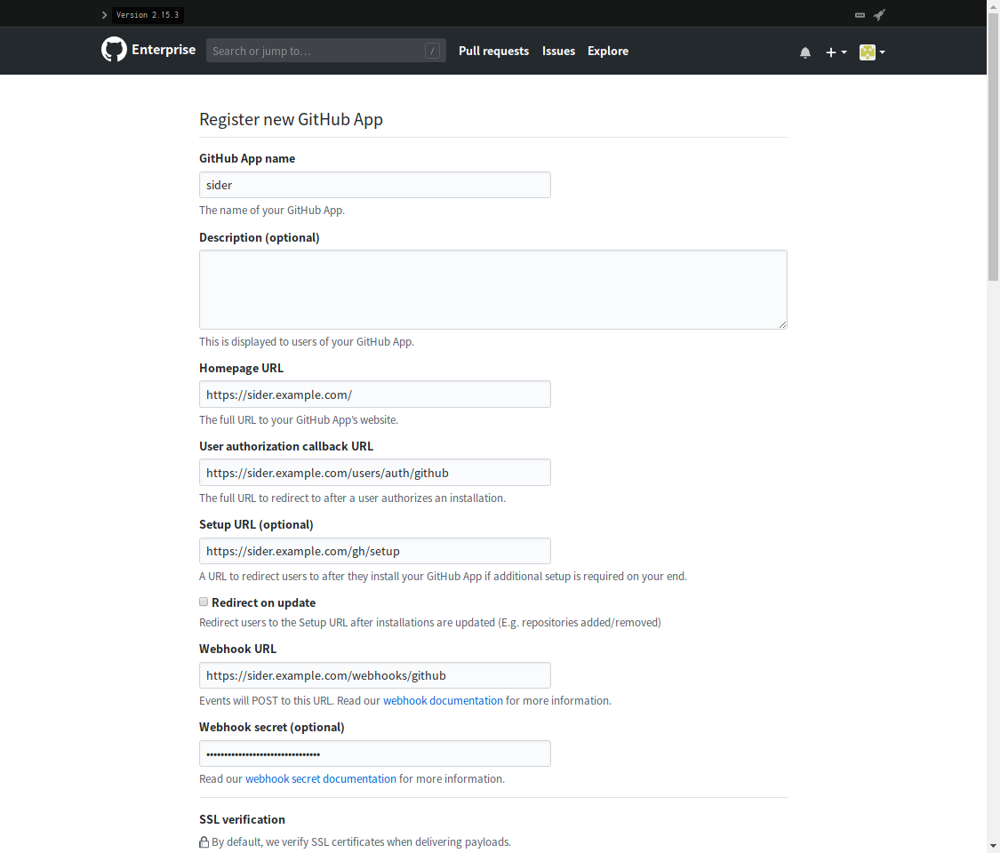
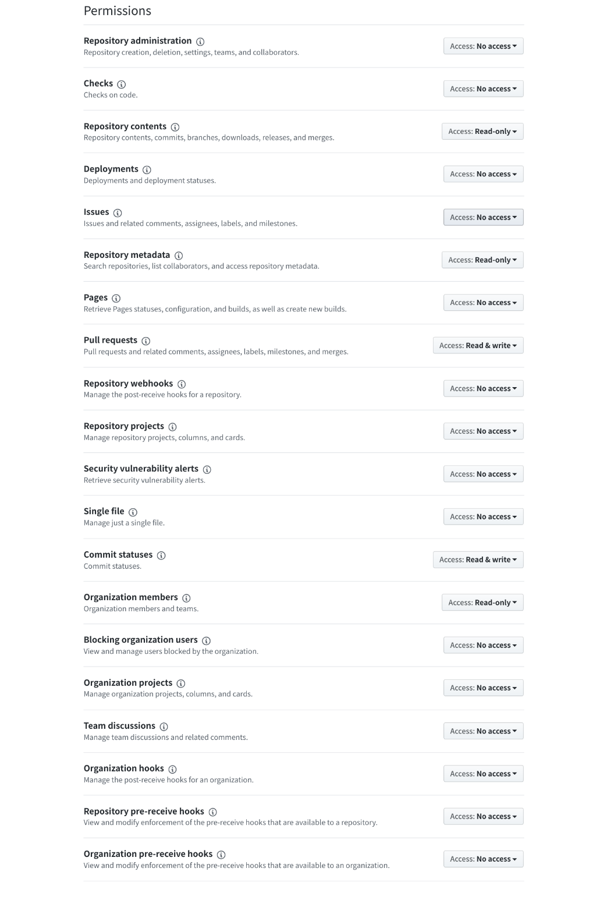
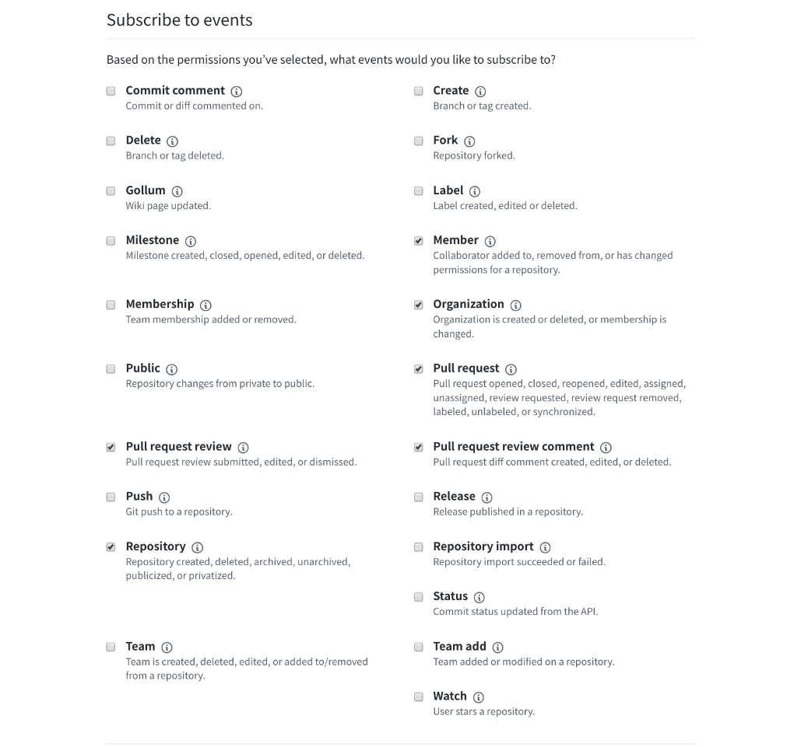
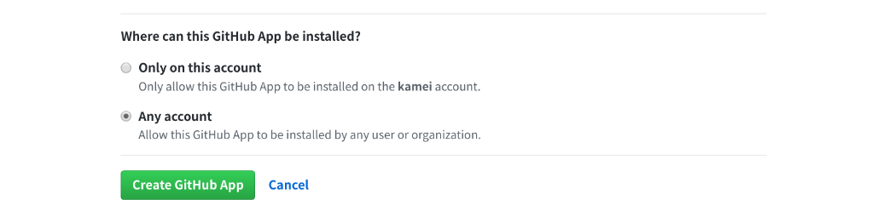

# Setup Guide

We have provided a guide to test whether applications have been correctly set up.
* [Testing Guide](../testing/guide.md)

### Creating an OAuth App for Sider
First of all, create a new OAuth app on GitHub Enterprise; check "[Creating an OAuth App](https://developer.github.com/apps/building-oauth-apps/creating-an-oauth-app/)" as necessary.
Fill in each field to match your specifications:

* **Application name**: `Sider`
* **Homepage URL**: `https://[your-web-service-domain]/` (e.g. `https://sider.review/`)
* **Application description**: (optional)
* **Authorization callback URL**: `https://[your-web-service-domain]/users/auth/github`


After successful registration, store the **Client ID** and **Client Secret** with the environment variables below:

* **Client ID**: `GITHUB_CLIENT_ID`
* **Client Secret**: `GITHUB_CLIENT_SECRET`

### Creating a new GitHub App for Sider

You must also create a new GitHub App for Sider. Follow these steps:

1. Go to `https://[your-github-enterprise-domain]/organizations/[your-organization-name]/settings/apps/new`
    - `[your-organization-name]` is an arbitrary organization name. You can see your organizations on:
      `https://[your-github-enterprise-domain]/settings/organizations`

2. Fill out the **Register new GitHub App** form by specifying the following:
    - **GitHub App name**: `Sider`
        + Store the value in lowercase as an environment variable `GITHUB_APP_NAME`
    - **Homepage URL**: `https://[your-web-service-domain]/` (e.g. `https://sider.example.com/`)
    - **User authorization callback URL**: `https://[your-web-service-domain]/users/auth/github_app_oauth2/callback`
    - **Setup URL**: `https://[your-web-service-domain]/gh/setup`
    - **Webhook URL**: `https://[your-web-service-domain]/webhooks/github`
    - **Webhook secret**: Arbitrary secret characters
        + For example, you can get it by running `tr -dc '[:alnum:]' < /dev/urandom | head -c32` on your terminal.
        + Store the value as an environment variable `GITHUB_APP_WEBHOOK_SECRET`



3. Set up the application's **Permissions** like below:

    | Permission name      | Access       |
    | -------------------- | ------------ |
    | Repository contents  | Read-only    |
    | Repository metadata  | Read-only    |
    | Pull requests        | Read & Write |
    | Commit statuses      | Read & Write |
    | Organization members | Read-only    |



4. Enable the following events on **Subscribe to events**:
    * **Member**
    * **Organization**
    * **Pull request**
    * **Pull request review**
    * **Pull request review comment**
    * **Repository**



5. Choose **Any account** on **Where can this GitHub App be installed?**



6. Click **Create GitHub App**
    - After the success of the registration, keep the parameters as environment variables:
        + **ID** as `GITHUB_APP_ID`
        + **Client ID** as `GITHUB_APP_OAUTH2_CLIENT_ID`
        + **Client secret** as `GITHUB_APP_OAUTH2_CLIENT_SECRET`

7. Click **Generate private key**
    - Then your browser downloads PEM file

8. Encode the PEM file with Base64 and keep the value as an environment variable `GITHUB_APP_PRIVATE_KEY`
    - Run `base64 /path/to/PEM` if your OS is macOS
    - Run `base64 -w0 /path/to/PEM` if your OS is Linux

### Create a Database Instance
Create a database instance on AWS; as needed, check "[Creating a DB Instance Running the MySQL Database Engine](https://docs.aws.amazon.com/AmazonRDS/latest/UserGuide/USER_CreateInstance.html)". After creating a database, select the engine version `5.7.x`. Then select an instance type and a stage size according to your team's scale. We have confirmed behaviors when we set `db.t2.medium` and `50GB` storage size as a test.

> Pay attention not to create initial databases when creating an instance on RDS because it has problems against character code. And, `max_allowed_packet` should be set around `128MB` to store analysis results in the database properly.

### Create an ElastiCache cluster
Create an ElastiCache cluster; as needed, check "[What Is Amazon ElastiCache for Redis?](https://docs.aws.amazon.com/AmazonElastiCache/latest/red-ug/WhatIs.html)".
We have confirmed behaviors in our environment for testing; which is uses `cache.r3.large`.

In addition, set `timeout` around `60` in parameter group because Redis clusters created with ElastiCache has no setting for timeout.

### Create a bucket
Create a bucket; as needed, check "[Create a Bucket](https://docs.aws.amazon.com/AmazonS3/latest/gsg/CreatingABucket.html)". The bucket you created stores your encrypted source code. One of Sider's applications downloads the source code by using URL which S3 created when analyzing.

You need to set the bucket policy like the example below to ensure Sider has permission for operation and security:

```json
{
  "Id": "AllowVPCE",
  "Statement": [
    {
      "Action": "s3:GetObject",
      "Effect": "Allow",
      "Principal": "*",
      "Resource": "arn:aws:s3:::your-bucket-name/*",
      "Sid": "AllowS3Download"
    }
  ],
  "Version": "2012-10-17"
}
```

The policy permits access to objects via URL input directly although it doesn't permit access to the index of objects. You can be assured of security because Sider uploads files with designated unpredictable object keys.

If you'd like to be assured with a higher level of security, you could consider some additional methods; restricting access to specific VPC endpoints or restricting computers that can access via certain IP addresses?

* [Example Bucket Policies for VPC Endpoints for Amazon S3](https://docs.aws.amazon.com/AmazonS3/latest/dev/example-bucket-policies-vpc-endpoint.html)

We have recommended set rules to delete stored archives every week because the archives will remain if not set to be deleted.

### Create an Amazon EC2 instance
Create an instance; as needed, check "[Getting Started with Amazon EC2 Linux Instances](https://docs.aws.amazon.com/AWSEC2/latest/UserGuide/EC2_GetStarted.html)".
You can select EC2 instance type and storage size according to your team's scale. We have confirmed behaviors when we set `c4.2xlarge` and `50GB` as storage size as a test.

The guide assumes you are using `Amazon Linux AMI 2017.09`. However, there are no requirements for AMI if you can run Docker.

An application that runs on an instance uploads your source code to S3. Thus, you need to set IAM roles that attach IAM policy in order to permit API calls. The following policy is an example which restricts API requests to specific buckets.

```json
{
  "Version": "2012-10-17",
  "Statement": [
    {
      "Sid": "Stmt151246256049",
      "Action": "s3:*",
      "Effect": "Allow",
      "Resource": "arn:aws:s3:::your-bucket-name/*"
    }
  ]
}
```

### Install Docker
Install Docker after connecting your EC2 instance via SSH; you can use the following document "[Get Docker CE for CentOS](https://docs.docker.com/install/linux/docker-ce/centos/)".
We had confirmed behavior when we used `Docker 17.06.2-ce` as a test.

### Install docker-compose
Install docker-compose; you can use the following document "[Install Compose](https://docs.docker.com/compose/install/#install-compose)".
We had confirmed behavior when we used docker-compose version `1.17.0` as a test.

#### Download Application Images
Sider consists of 3 applications which are provided as Docker images on Quay.io. Pull the images with a robot account that can access Quay.io.
When you login in with a robot account, the document "[Robot Accounts](https://docs.quay.io/glossary/robot-accounts.html)" will help you.

```
$ docker pull quay.io/actcat/sideci:${VERSION}
$ docker pull quay.io/actcat/catpost:${VERSION}
$ docker pull quay.io/actcat/setaria:${VERSION}
```

We will introduce the details of the robot account and Docker images version separately.

#### Set Environment Variables
Set required environment variables for each application. You need to replace `{{...}}` with proper parameters.

##### ENV File for Sider
Create `sideci.env` as an env file for Sider.

> `EXCEPTION_NOTIFIER_EMAIL` and `EXCEPTION_NOTIFIER_BUGSNAG` will be optional variables in the future.

> `BUGSNAG_API_KEY` is required even if you don't use Bugsnag. Please set to something like "foo".

```:sideci.env
RAILS_ENV=onprem
SECRET_KEY_BASE={{FIXME: Secret for running the application}}
DATABASE_URL=mysql2://{{FIXME: RDS user name}}:{{FIXME: RDS user password}}@{{FIXME: RDS endpoint}}/sideci?encoding=utf8mb4&connectTimeout=5000&sslca=config/rds-combined-ca-bundle.pem
REDIS_URL=redis://{{FIXME: Redis endpoint}}/0
BUGSNAG_API_KEY={{FIXME: Bugsnag API key}}
EXCEPTION_NOTIFIER_RECIPIENT_EMAILS={{FIXME: Email address to receive exception notifications}}
ACTION_MAILER_SMTP_USER_NAME={{FIXME: SMTP user name}}
ACTION_MAILER_SMTP_USER_PASSWORD={{FIXME: SMTP user password}}
ACTION_MAILER_SMTP_DOMAIN={{FIXME: Domain name}}
ACTION_MAILER_SMTP_ADDRESS={{FIXME: SMTP server host}}
ACTION_MAILER_SMTP_PORT={{FIXME: SMTP server port number}}
ACTION_MAILER_SMTP_AUTHENTICATION={{FIXME: SMTP authentication method}}
ACTION_MAILER_SMTP_ENABLE_STARTSSL_AUTO=true
ACTION_MAILER_DEFAULT_FROM_EMAIL={{FIXME: Default FROM Email address}}
BASE_URL=https://{{FIXME: Your Sider domain name}}
PUSHER_API_ID={{FIXME: Your Pusher API ID}}
PUSHER_API_KEY={{FIXME: Your Pusher API Key}}
PUSHER_API_SECRET={{FIXME: Your Pusher API Secret}}
PUSHER_CLUSTER={{FIXME: Your Pusher cluster name}}
GITHUB_APP_ID={{FIXME: Your GitHub App ID}}
GITHUB_APP_NAME={{FIXME: Your GitHub App name}}
GITHUB_APP_PRIVATE_KEY={{FIXME: Your GitHub App Private Key encoded with Base64}}
GITHUB_APP_OAUTH2_CLIENT_ID={{FIXME: Your GitHub App OAuth2 Client ID}}
GITHUB_APP_OAUTH2_CLIENT_SECRET={{FIXME: Your GitHub App OAuth2 Client Secret}}
GITHUB_APP_WEBHOOK_SECRET={{FIXME: Your GitHub App Webhook Secret}}
GITHUB_CLIENT_ID={{FIXME: Your GitHub Enterprise OAuth2 client ID}}
GITHUB_CLIENT_SECRET={{FIXME: Your GitHub Enterprise OAuth2 client secret}}
GITHUB_API_ENDPOINT=https://{{FIXME: Your GitHub Enterprise host name}}/api/v3/
GITHUB_ENDPOINT=https://{{FIXME: Your GitHub Enterprise host name}}/
CATPOST_BASE_URL=http://catpost_web:3000
CATPOST_SECRET={{FIXME: Catpost secret}}
SETARIA_BASE_URL=http://setaria_web:3000
SETARIA_SECRET={{FIXME: Setaria secret}}
LOGGLY_URL=https://logs-01.loggly.com/inputs/{{FIXME: Loggly token}}/tag/sideci
```

##### ENV File for Catpost
Create `catpost.env` as an env file for Catpost.

> `EXCEPTION_NOTIFIER_EMAIL` and `EXCEPTION_NOTIFIER_BUGSNAG` will be optional variables and `API_TOKEN` will be replaced with `API_SECRET` in the future.

> `BUGSNAG_API_KEY` is required even if you don't use Bugsnag. Please set to something like "foo".

```:catpost.env
RAILS_ENV=onprem
SECRET_KEY_BASE={{FIXME: Secret for running the application}}
DATABASE_URL=mysql2://{{FIXME: RDS user name}}:{{FIXME: RDS user password}}@{{FIXME: RDS endpoint}}/catpost?encoding=utf8mb4&charset=utf8mb4&sslca=config/rds-combined-ca-bundle.pem
REDIS_URL=redis://{{FIXME: Redis endpoint}}/1
BUGSNAG_API_KEY={{FIXME: Bugsnag API key}}
EXCEPTION_NOTIFIER_RECIPIENT_EMAILS={{FIXME: Email address to receive exception notifications}}
ACTION_MAILER_SMTP_USER_NAME={{FIXME: SMTP user name}}
ACTION_MAILER_SMTP_USER_PASSWORD={{FIXME: SMTP user password}}
ACTION_MAILER_SMTP_DOMAIN={{FIXME: Domain name}}
ACTION_MAILER_SMTP_ADDRESS={{FIXME: SMTP server host}}
ACTION_MAILER_SMTP_PORT={{FIXME: SMTP server port number}}
ACTION_MAILER_SMTP_AUTHENTICATION={{FIXME: SMTP authentication method}}
ACTION_MAILER_SMTP_ENABLE_STARTSSL_AUTO=true
ACTION_MAILER_DEFAULT_FROM_EMAIL={{FIXME: Default FROM Email address}}
S3_BUCKET_NAME={{FIXME: Your S3 bucket name}}
S3_REGION_NAME={{FIXME: Your AWS region name}}
API_TOKEN={{FIXME: Catpost secret}}
ARCHIVE_ENCRYPTION_KEY={{FIXME: Archive Encryption key}}
ARCHIVE_NAME_SECRET={{FIXME: Archive name secret}}
GIT_REPOS_DIR=/var/git_repos
TERM_CHILD=1
QUEUE=*
VERBOSE=1
LOGGLY_URL=https://logs-01.loggly.com/inputs/{{FIXME: Loggly token}}/tag/catpost
```

##### ENV File for Setaria
Create `setaria.env` as an env file for Setaria.

> `EXCEPTION_NOTIFIER_EMAIL` and `EXCEPTION_NOTIFIER_BUGSNAG` will be optional variables in the future.

> `BUGSNAG_API_KEY` is required even if you don't use Bugsnag. Please set to something like "foo".

```:setaria.env
RAILS_ENV=onprem
SECRET_KEY_BASE={{FIXME: Secret for running the application}}
DATABASE_URL=mysql2://{{FIXME: RDS user name}}:{{FIXME: RDS user password}}@{{FIXME: RDS endpoint}}/setaria?encoding=utf8mb4&sslca=config/rds-combined-ca-bundle.pem
REDIS_URL=redis://{{FIXME: Redis endpoint}}/2
BUGSNAG_API_KEY={{FIXME: Bugsnag API key}}
EXCEPTION_NOTIFIER_RECIPIENT_EMAILS={{FIXME: Email address to receive exception notifications}}
ACTION_MAILER_SMTP_USER_NAME={{FIXME: SMTP user name}}
ACTION_MAILER_SMTP_USER_PASSWORD={{FIXME: SMTP user password}}
ACTION_MAILER_SMTP_DOMAIN={{FIXME: Domain name}}
ACTION_MAILER_SMTP_ADDRESS={{FIXME: SMTP server host}}
ACTION_MAILER_SMTP_PORT={{FIXME: SMTP server port number}}
ACTION_MAILER_SMTP_AUTHENTICATION={{FIXME: SMTP authentication method}}
ACTION_MAILER_SMTP_ENABLE_STARTSSL_AUTO=true
ACTION_MAILER_DEFAULT_FROM_EMAIL={{FIXME: Default FROM Email address}}
API_SECRET={{FIXME: Setaria secret}}
TERM_CHILD=1
QUEUE=*
VERBOSE=1
LOGGLY_URL=https://logs-01.loggly.com/inputs/{{FIXME: Loggly token}}/tag/setaria
```

#### Details of Environment Variables

| Variable Name | Application | Description |
| :------------ | :---------- | :---------- |
| `RAILS_ENV` | ALL | Set `onprem`. You don't need to change the value. |
| `SECRET_KEY_BASE` | ALL | A value to create a Cookie. You need to use the value created from executing `rake secret` and it MUST use a different value for each application. |
| `DATABASE_URL` | ALL | The endpoint when you created a database instance. Although you should use parameters of `encoding`, `charset`, and `sslca` without revisions, you should revise the username, password, domain and port number according to your team. |
| `REDIS_URL` | ALL | The endpoint when you create an ElastiCache cluster. The domain and port number should be revised according to your team. Set different IDs at the end of the parameters for each application. Don't share queues because we suppose that three Sider applications use the same ElastiCache cluster. |
| `EXCEPTION_NOTIFIER_RECIPIENT_EMAILS` | ALL | An email address to notify with details when applications raise unhandled exceptions. You can set multiple email addresses by separating them with commas. |
| `ACTION_MAILER_SMTP_USER_NAME` | ALL | The username to authenticate your mail server. See "[Action Mailer Configuration](https://guides.rubyonrails.org/action_mailer_basics.html#action-mailer-configuration)". |
| `ACTION_MAILER_SMTP_USER_PASSWORD` | ALL | The user password to authenticate your mail server. See "[Action Mailer Configuration](https://guides.rubyonrails.org/action_mailer_basics.html#action-mailer-configuration)". |
| `ACTION_MAILER_SMTP_DOMAIN` | ALL | A HELO domain to identify the domain name. See "[Action Mailer Configuration](https://guides.rubyonrails.org/action_mailer_basics.html#action-mailer-configuration)". |
| `ACTION_MAILER_SMTP_ADDRESS` | ALL | The remote mail server to send emails from applications. See "[Action Mailer Configuration](https://guides.rubyonrails.org/action_mailer_basics.html#action-mailer-configuration)". |
| `ACTION_MAILER_SMTP_PORT` | ALL | The port number of your mail server. See "[Action Mailer Configuration](https://guides.rubyonrails.org/action_mailer_basics.html#action-mailer-configuration)". |
| `ACTION_MAILER_SMTP_AUTHENTICATION` | ALL | The authentication type. See "[Action Mailer Configuration](https://guides.rubyonrails.org/action_mailer_basics.html#action-mailer-configuration)". |
| `ACTION_MAILER_SMTP_ENABLE_STARTSSL_AUTO` | ALL | Detects if STARTTLS is enabled in your STTP server. The default value is `true`. See "[Action Mailer Configuration](https://guides.rubyonrails.org/action_mailer_basics.html#action-mailer-configuration)". |
| `ACTION_MAILER_DEFAULT_FROM_EMAIL` | ALL | Default FROM Email address which is included in Emails sent from Sider |
| `BASE_URL` | sideci | Homepage URL you got when you registered for an OAuth App. |
| `PUSHER_API_ID` | sideci | Value provided by Pusher. |
| `PUSHER_API_KEY` | sideci | Value provided by Pusher. |
| `PUSHER_API_SECRET` | sideci | Value provided by Pusher. |
| `PUSHER_CLUSTER` | sideci | Value provided by Pusher. |
| `GITHUB_APP_ID` | sideci | GitHub App ID. See "[Creating a new GitHub App for Sider](#creating-a-new-github-app-for-sider)". |
| `GITHUB_APP_NAME` | sideci | GitHub App name. We recommend you to set the value to `sider`. See "[Creating a new GitHub App for Sider](#creating-a-new-github-app-for-sider)". |
| `GITHUB_APP_PRIVATE_KEY` | sideci | GitHub App private key encoded with Base64. See "[Creating a new GitHub App for Sider](#creating-a-new-github-app-for-sider)". |
| `GITHUB_APP_OAUTH2_CLIENT_ID` | sideci | GitHub App OAuth2 client ID. See "[Creating a new GitHub App for Sider](#creating-a-new-github-app-for-sider)". |
| `GITHUB_APP_OAUTH2_CLIENT_SECRET` | sideci | GitHub App OAuth2 client secret. See "[Creating a new GitHub App for Sider](#creating-a-new-github-app-for-sider)". |
| `GITHUB_APP_WEBHOOK_SECRET` | sideci | GitHub App Webhook secret. See "[Creating a new GitHub App for Sider](#creating-a-new-github-app-for-sider)". |
| `GITHUB_CLIENT_ID` | sideci | Client ID you got when registering for an OAuth App. |
| `GITHUB_CLIENT_SECRET` | sideci | Client Secret you got when registering for an OAuth App. |
| `GITHUB_API_ENDPOINT` | sideci | API endpoint that Sider uses to connect GitHub Enterprise; which is `https://[your-github-enterprise-host]/api/v3/`. |
| `CATPOST_BASE_URL` | sideci | Set `http://catpost_web:3000`. If you would like to change the service name or port number on `docker-compose`, replace the URL with the name/number you set. |
| `CATPOST_SECRET` | sideci | Set the same value of `API_TOKEN`. |
| `SETARIA_BASE_URL` | sideci | Set to `http://setaria_web:3000`. If you would like to change the service name or port number on `docker-compose`, replace the URL with the name/number you set. |
| `SETARIA_SECRET` | sideci | Set the same value of `API_SECRET`. |
| `API_TOKEN` | catpost | The token that is used for authentication for API connections. We recommend you to set it to an adequate length of characters, which you can generate with `rake secret`. |
| `API_SECRET` | setaria | The token that is used for authentication for API connections. We recommend you to set it to an adequate length of characters, which you can generate with `rake secret`. |
| `BUGSNAG_API_KEY` | ALL | API key provided by Bugsnag. Bugsnag is used for investigating problems. |
| `LOGGLY_URL` | ALL | URL provided by Loggly. Loggly is used for investigating problems. |
| `S3_BUCKET_NAME` | catpost | The bucket name you got when you created a bucket. |
| `S3_REGION_NAME` | catpost | The region name you got when you created a bucket. |
| `ARCHIVE_ENCRYPTION_KEY` | catpost | The key that is used to encrypt source code before analyzing. Set characters; you can get it with following [command](#command-to-get-keys). |
| `ARCHIVE_NAME_SECRET` | catpost | The random data that is used to hash archived names of encrypted source code. Set characters; you can get it with following [command](#command-to-get-keys). |
| `GIT_REPOS_DIR` | catpost | Directory names that Catpost stores cache to at local storage. Specify the file path on the container which is mounted on run. |


##### Command to get keys

The following command will give you keys to untilize as encryption keys:

* `GITHUB_OAUTH_HEAD_ENCRYPTION_KEY`
* `URL_ENCRYPTION_KEY`
* `ARCHIVE_ENCRYPTION_KEY`
* `ARCHIVE_NAME_SECRET`
* `SSH_KEY_ENCRYPTION_KEY`.

```
$ tr -dc '[:alnum:]' < /dev/urandom | head -c32
```

#### Settings for docker-compose
Create `docker-compose.yml` to run Sider applications. `sideci.env`, `catpost.env` and `setaria.env` are the files mentioned above.
You need to replace `{{RELEASE_TAG}}` with an actual tag name.

```yaml:docker-compose.yml
version: '3'
services:
  sideci_web:
    image: quay.io/actcat/sideci:{{RELEASE_TAG}}
    env_file:
      - ./sideci.env
    command: bundle exec puma
    ports:
      - "3000:3000"
  sideci_worker:
    image: quay.io/actcat/sideci:{{RELEASE_TAG}}
    env_file:
      - ./sideci.env
    command: bundle exec sidekiq -C ./config/sidekiq.yml
  catpost_web:
    image: quay.io/actcat/catpost:{{RELEASE_TAG}}
    env_file:
      - ./catpost.env
    command: bundle exec puma
    ports:
      - "3000"
    volumes:
      - git_repos:/var/git_repos
  catpost_worker:
    image: quay.io/actcat/catpost:{{RELEASE_TAG}}
    env_file:
      - ./catpost.env
    command: bundle exec rake environment resque:work
    volumes:
      - git_repos:/var/git_repos
  catpost_scheduler:
    image: quay.io/actcat/catpost:{{RELEASE_TAG}}
    env_file:
      - ./catpost.env
    command: bundle exec rake environment resque:scheduler
    volumes:
      - git_repos:/var/git_repos
  setaria_web:
    image: quay.io/actcat/setaria:{{RELEASE_TAG}}
    env_file:
      - ./setaria.env
    command: bundle exec puma
    ports:
      - "3000"
    volumes:
      - /var/run/docker.sock:/var/run/docker.sock:ro
  setaria_worker:
    image: quay.io/actcat/setaria:{{RELEASE_TAG}}
    env_file:
      - ./setaria.env
    command: bundle exec rake environment resque:work
    volumes:
      - /var/run/docker.sock:/var/run/docker.sock:ro
volumes:
  git_repos:
```

### Setup Database
Start containers and create a database and tables base with the `docker-compose.yml`.

```
$ docker-compose run sideci_web bundle exec rake db:setup
$ docker-compose run catpost_web bundle exec rake db:setup
$ docker-compose run setaria_web bundle exec rake db:setup
```

### Starting Applications
Run the applications after completing the database setup.

```
$ docker-compose up
```

### Create Elastic Load Balancing(ELB)
Create a load balancer to receive requests from the exterior through port 443 because you can send HTTP requests to the applications on port 3000 from the EC2 instance. To create the Application Load Balancer, you need to route HTTPS requests to port 3000 for the EC2 instance. This document, "[Create an Application Load Balancer](https://docs.aws.amazon.com/elasticloadbalancing/latest/application/create-application-load-balancer.html)" will tell you about the load balancer creation on AWS.

* We recommend to permit only HTTPS requests when introducing Sider.
  * Of course, you can examine Sider with HTTP.
* Designate `/api/health_check` as the path for health check.
* DO NOT use Classic Load Balancer because we have confirmed that problems  occurred when connecting it to sideci.

Lastly, register CNAME record which can resolve `BASE_URL` with ELB endpoint on DNS.

### Check Behaviors of Applications
When all configurations are completed, you will see the Sider pages with the URL registered on DNS. Please do the checks below:

* Correctly redirect to GitHub Enterprise when signing up to Sider.
* The repositories you have on GitHub Enterprise show up in "Select a Repository" page.
* Pull requests that are added into Sider start getting analyzed.

The Sider build is complete if the check behaviors pass!

### Settings for Batch Tasks
Sider has tasks which should be executed to keep operations stable. Set crontab to run the following commands every day.

```
$ docker-compose run sideci_web bundle exec rake onprem:batch:daily
$ docker-compose run catpost_web bundle exec rake onprem:batch:daily
$ docker-compose run setaria_web bundle exec rake onprem:batch:daily
```

We recommend executing these commands when there is less analysis because these commands update database records for all users and all repositories.

### Prune Docker Images
As you use Sider, disk usage will increase because of the increase in unused images. This is why:

* Older versions of images of Sider won't be used after you update it.
* Older versions of images of analyzers won't be used after you update them.

Unexpected errors occur when unused images occupy the disk. We recommend pruning the images on a regular basis.

```
$ docker image prune
$ docker image prune --all     # To prune ALL unused images of containers.
```

If you run these processes while running Sider, the application images, which are sideci, catpost and setaria, won't be deleted. On the other hand, idled analyzer images will be deleted. If that were the case, the missing analyzer images would be downloaded automatically when Sider requires them for analysis.

### Set Administrators
You can assign administrators who are able to access the administration console. The page provides registered users information, analysis information and so on for the administrators.

```
$ docker-compose run sideci_web bundle exec rake admin:promote[{{FIXME: github nickname}}]
```

Replace `{{FIXME: github nickname}}` with your GitHub username and execute the command. Only GitHub users assigned as administrators can access the console. You can see the GitHub usernames if you look at the user page in GitHub Enterprise; for example, if the page URL is `https://github.com/sider_user`, the user name is `sider_user`.

If a user is assigned as an administrator with the command above, sign into Sider with the GitHub Enterprise account and access it with `/admin` in Sider. For example, `https://github.com/sider_user/admin`.
