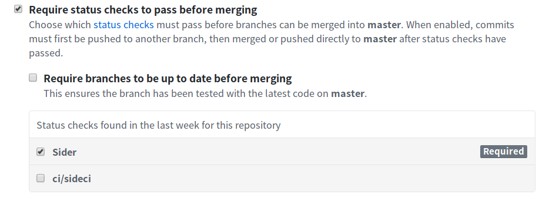

# Release Notes between 2018010801 to 201909.0

## release-201909

> **Caution**: You have to set the following new environment variables to update to this release.
> See the following _Update Procedure_ section.

- ENCRYPTION_SERVICE_KEY
- ENCRYPTION_SERVICE_SALT

Also, Sider requires Redis (>4.x) since this release, so please update the Redis server.

**Features**:

- Analysis Tools Updates
  - Include ktlint and Cppcheck supports
  - All tools are published on [Docker Hub](https://hub.docker.com/u/sider)
  - See the [CHANGELOG](https://github.com/sider/runners/blob/fc4c1ea771b1d187ab1e8453033999d22b7f82a4/CHANGELOG.md#030) for more details

**Fixes**:

- Bug fixes & UI design improvements

**Update Procedure**:

1. Download application images.
2. Stop applications.
3. Update release tags on `docker-compose.yml`.
   - Replace older release tags with `migration-for-201909`
4. Set the environment variable `ENCRYPTION_SERVICE_KEY` and `ENCRYPTION_SERVICE_SALT` in **every** service
   - In other words, you have to set them in `sideci.env`, `catpost.env`, and `setaria.env` files
   - `ENCRYPTION_SERVICE_KEY` should be random string
   - `ENCRYPTION_SERVICE_SALT` must be 32 byte of random string
5. Run the following "Commands 1" to apply the database changes
6. Update release tags on `docker-compose.yml`.
   - Replace older release tags with `release-201909.0`
7. Run the following "Commands 2" to apply the database changes
8. Start applications.

Commands 1:

```
docker-compose run --rm sideci_web bundle exec rails db:migrate VERSION=20190716022318
docker-compose run --rm sideci_web bundle exec rails r script/migrate/20190723_copy_encrypted_attributes_to_new_attributes.rb

docker-compose run --rm catpost_web bundle exec rails db:migrate VERSION=20190725081720
docker-compose run --rm catpost_web bundle exec rails r script/migrate/20190725_copy_url_to_url2.rb

docker-compose run --rm setaria_web bundle exec rails db:migrate VERSION=20190712075148
docker-compose run --rm setaria_web bundle exec rails r script/migrate/20190712_copy_ssh_key_to_ssh_key2.rb
```

Commands 2:

```
docker-compose run --rm sideci_web bundle exec rails db:migrate
docker-compose run --rm catpost_web bundle exec rails db:migrate
docker-compose run --rm setaria_web bundle exec rails db:migrate
```

The following environment variables are no longer required after running the above commands:

- `GITHUB_OAUTH_HEAD_ENCRYPTION_KEY`
- `URL_ENCRYPTION_KEY`
- `SSH_KEY_ENCRYPTION_KEY`

## release-201904

**Notes**:

From this release, SSH key generation on the repository page settings is limited to only admin users.

**Features**:

- [Analysis Tools Updates](https://blog.sideci.com/analysis-tools-updates-in-march-2019-9e5da6f594b9)
- Users can choose the versions of Ruby related tools with `Gemfile.lock` or `sider.yml`
  - See [here](../../getting-started/custom-configuration.md#linteranalyzer_idgems) for more details
- Support JSON, HCL and TOML languages in code highlighting on the pull request page
- Redesign the pull request page to separate into **Issues** and **Tools** tabs
- Support Sider Enterprise without Pusher configuration
- Support Markdown format in issue messages on the pull request page
  - You can now write the messages of your custom rules with Markdown format

**Fixes**:

- Bug fixes & UI design improvements

**Update Procedure**:

See [Update](../updating.md).

## release-201903

**Notes**:

From this release, Sider Enterprise only starts analyses of the pull requests created by users who have signed up Sider Enterprise, with the exception of ones by Bot account.
In other words, pull request authors must sign up Sider Enterprise if they want their pull requests to get analyzed.

**Features**:

- [Analysis Tools Updates](https://blog.sideci.com/analysis-tools-updates-in-february-2019-4943e1c82e83)
- [Restricting access to Close button](https://blog.sideci.com/restricting-access-to-close-button-b0d3e0c12346)
- [Defining rules for excluding branches with regular expressions](https://blog.sideci.com/defining-rules-for-excluding-branches-with-regular-expressions-bfd01edb6675)
- [Improved Slack integration](https://blog.sideci.com/sider-update-improved-slack-integration-6b51735d313)
- Add `SIDECI_TIMEZONE` configuration
  - This lets you see the timestamp on the admin page with an arbitrary time zone

**Fixes**:

- Bug fixes & UI design improvements

**Update Procedure**:

See [Update](../updating.md).

## release-201902

**Features**:

- Redesign the pull request page to stick the navigation header on top of it
- Improve RuboCop analysis so that users can install gems more flexibly (see [our blog](https://blog.sideci.com/now-available-flexible-gem-installation-for-rubocop-1ecee85eec2c))
- Add self-signup restriction
  - You can restrict your users from signing up by themselves
  - Set environment variable `RESTRICT_SIGN_UP` to `true` on sideci to enable this feature

**Fixes**:

- Bug fixes & UI design improvements

**Update Procedure**:

See [Update](../updating.md).

### catpost: `ACTION_MAILER_DEFAULT_FROM_EMAIL` is required

`ACTION_MAILER_DEFAULT_FROM_EMAIL` is now required and cannot be empty. See [Configure gem page](https://github.com/sider/configure) for details.

### setaria: `ACTION_MAILER_DEFAULT_FROM_EMAIL` is required

`ACTION_MAILER_DEFAULT_FROM_EMAIL` is now required and cannot be empty. See [Configure gem page](https://github.com/sider/configure) for details.

### setaria: Analyzer containers start in the parent containers' network

Analyzer containers now run in the parent (`setaria_worker`) containers' network.
If you want to run the analyzer containers in the _default_ network, specify an environment variable `RUNNER_USE_DEFAULT_NETWORK=1`.

## release-2019013001

- Fix user deletion function on Admin page

**Notes**:

This release is applied to only sideci.

**Update Procedure**:

Follow the below steps:

1. Run `docker-compose down` to stop applications
2. Replace docker image tags of "sideci_web" and "sideci_worker" with **release-2019013001** in "docker-compose.yml"
3. Run `docker-compose run sideci_web bundle exec rake db:migrate db:seed_fu`
4. Run `docker-compose up` to start applications

## release-2019011001

**Features**:

- Update the Admin Dashboard page to show more detailed statistics
- Redesign the repository settings page
- Redesign the display of issues on the pull request page
- Add support for GitHub Apps (see [our blog](https://blog.sideci.com/you-can-now-install-sider-as-a-github-app-f52a073b54b7))

**Fixes**:

- Bug fixes & UI design improvements
- Remove "Account & Billing" from the organization page because it's not necessary for Sider Enterprise

**Notes**:

- Drop support for translation of issues (For more details, see [our blog](https://blog-ja.sideci.com/entry/20181203-announsement))

**Update Procedure**:

This release requires you to configure additional settings.

First, follow the [guide](../github.md) to create a GitHub App on your GitHub Enterprise.

Secondly, set the environment variable `ACTION_MAILER_DEFAULT_FROM_EMAIL` in `sideci.env`, `catpost.env`, and `setaria.env` file.
For example, you can set it `support@example.com`. This email address is used when sending system error. See [here](../config.md).

After that, update Sider Enterprise as usual (See [here](../updating.md)).

## release-2018121001

**Features**:

- [Analysis Tools Updates](https://blog.sideci.com/announcement-20181122-fac5ba645901)
- [New Add Repository Flow](https://blog.sideci.com/announcement-20181114-a6314d4c015c)

**Fixes**:

- Validations of environment variables
  - Previously, sideci would start even if required environment variables were missing, which can lead to runtime
    errors. The server will now raise an error at startup if any required environment variables are missing.

**Update Procedure**:

See [Update](../updating.md).

## release-2018111201

**Features**:

- [Analysis Tools Updates](https://blog.sideci.com/announcement-20181016-1cab5c2cca70)
- [New Repository Page](https://blog.sideci.com/announcement-20181105-6f2b2b66164)

**Fixes**:

- [GitHub OAuth2 Authorization Scopes Change](https://blog.sideci.com/github-authorization-scopes-update-8225a2d90cdf)
- Fix Invalidation process for browser sessions

**Update Procedure**:

See [Update](../updating.md).

And you MUST run this command:

```
$ docker-compose run --rm sideci_web bundle exec rails r script/migrate/20181105_remove_unused_tools.rb
```

## release-2018101201

**Features**:

- Add [Phinder](../../tools/php/phinder.md) - A new analyzer for PHP
- [New analysis page](https://blog.sideci.com/announcing-new-analysis-page-d7ce2f39df7f)

**Fixes**:

- Bug fixes
- Use HTTPS for Pusher
  - Although using HTTP, the data leakage has not occurred because we have not included secure data in Pusher payload.
    We just use it for triggering dispatch in browsers

**Update Procedure**:

See [Update](../updating.md).

## release-2018091101

**Features**:

- Send emails when the inline comments fail

**Fixes**:

- Fixed several UI issues
- Bug fixes

**Update Procedure**:

See [Update](../updating.md).

## release-2018081501

Main changes are as follows.

**Fixes**:

- Fix failure to delete users on admin page

## release-2018072001

Main changes are as follows.

**Fixes**:

- Fix failure to rendering analysis results page and newsfeed pages when pull requests which had been opened since several month ago remained on Sider.

**Update Procedure**:

For updating, see also [Update](../updating.md).

1. Download the application image of `sideci`.
2. Stop applications.
3. Refresh release tag on `docker-compose.yml`.
   - For `sideci_web` and `sideci_worker`, replace older release tags with `release-2018072001`.
4. Start applications.

## release-2018071701

Main changes are as follows.

**Features**:

- Enable to change language(English/Japanese) on account page.

**Update Procedure**:

This update has required to apply changes to database.

1. Download application images.
2. Stop applications.
3. Refresh release tags on `docker-compose.yml`.
   - Replace older release tags with `release-2018071701`.
4. Run migration process(as follows commands).
5. Start applications.

Commands:

```
$ docker-compose run --rm sideci_web bundle exec rake db:migrate VERSION=20180621063716
$ docker-compose run --rm sideci_web bundle exec rails r 'User.where(locale: nil).find_each { |user| user.update!(locale: :ja) }'
$ docker-compose run --rm sideci_web bundle exec rake db:migrate
$ docker-compose run --rm catpost_web bundle exec rake db:migrate
$ docker-compose run --rm setaria_web bundle exec rake db:migrate
```

You can use `:en` instead of `:ja`. When you set `:ja` in the command, you will use Sider pages in Japanese. On the other hand, when you set `:en`, you will do it in English.

Although, in those commands, you have to set the same languages, `:ja` or `:en`, to execute migration scripts, any users can change language on their account pages. This [article](https://blog.sideci.com/setting-language-preferences-in-your-account-bb3ee6b42a07) has explained about the feature.

## release-2018061501

Main changes are as follows.

**Changes**:

- Change context name of commit status to `Sider` from `ci/sideci` on pull request pages.

If you have enabled `Required` for `ci/sideci` as "Require status checks" on repository settings, you have to disable it before update. After applying changes, require status check with `Sider`.



**Update Procedure**:

For updating, see also [Update](../updating.md).

1. Download application images.
2. Stop applications.
3. Refresh release tag on `docker-compose.yml`.
   - Replace older release tags with `release-2018061501`.
4. Start applications.

## release-2018051401

**Update Procedure**:

Apply the update with following steps.

1. Download application images.
2. Stop applications.
3. Refresh release tags on `docker-compose.yml`.
   - Replace older release tags with `release-2018051401`.
4. Run migration process(as follows commands).
5. Start applications.

Commands:

```
$ docker-compose run --rm sideci_web bundle exec rake db:migrate VERSION=20180423083742
$ docker-compose run --rm sideci_web bundle exec rails r 'Services::ApiCacheRefreshService.refresh_all!'
$ docker-compose run --rm sideci_web bundle exec rake db:migrate
$ docker-compose run --rm catpost_web bundle exec rake db:migrate
$ docker-compose run --rm setaria_web bundle exec rake db:migrate
```

## release-2018041601

**Update Procedure**:

Apply the update with following steps.

1. Download application images.
2. Stop applications.
3. Refresh release tags on `docker-compose.yml`.
   - Replace older release tags with `release-2018041601`.
4. Run migration process(as follows commands).
5. Start applications.

Commands:

```
$ docker-compose run --rm sideci_web bundle exec rake db:migrate VERSION=20180326070805
$ docker-compose run --rm sideci_web bundle exec rails r script/migrate/20180402_set_display_name_from_name_in_organizations.rb
$ docker-compose run --rm sideci_web bundle exec rake db:migrate
$ docker-compose run --rm catpost_web bundle exec rake db:migrate
$ docker-compose run --rm setaria_web bundle exec rake db:migrate
```

## release-2018030701

We highly recommend to stop all services when applying this update.

You can stop all services with command:

```sh
$ docker-compose down
```

**Update Procedure**:

Apply the update with following steps.

1. Download application images.
2. Stop applications.
3. Refresh release tags on `docker-compose.yml`.
   - Replace older release tags with `release-2018030701`.
4. Run migration process(as follows commands).
5. Start applications.

In addition to the steps, you have to do other 2 steps:

### Replace a Value on `docker-compose.yml`

This version has fixed that pull request status had been the same as SaaS side. To apply the fix, replace `command` of `sideci_worker` with below:

```
bundle exec sidekiq -C ./config/sidekiq.yml
```

### Update Database

With following commands, update database:

```
$ docker-compose run --rm sideci_web bundle exec rails r script/migrate/20180220_ghrepo_null2false.rb
$ docker-compose run --rm sideci_web bundle exec rails r script/migrate/20180123_migrate_trial_subscriptions.rb
$ docker-compose run --rm sideci_web bundle exec rails r script/migrate/20180302_update_last_analyzed_at_of_pull_requests.rb
```

These commands will

- apply database update by SideCI refactoring.
- fix failure to render old analysis on pull requests page.

## release-2018010801

Initial release🎉
