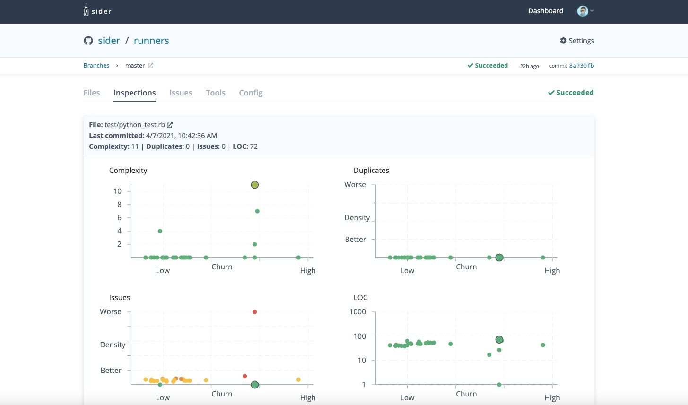
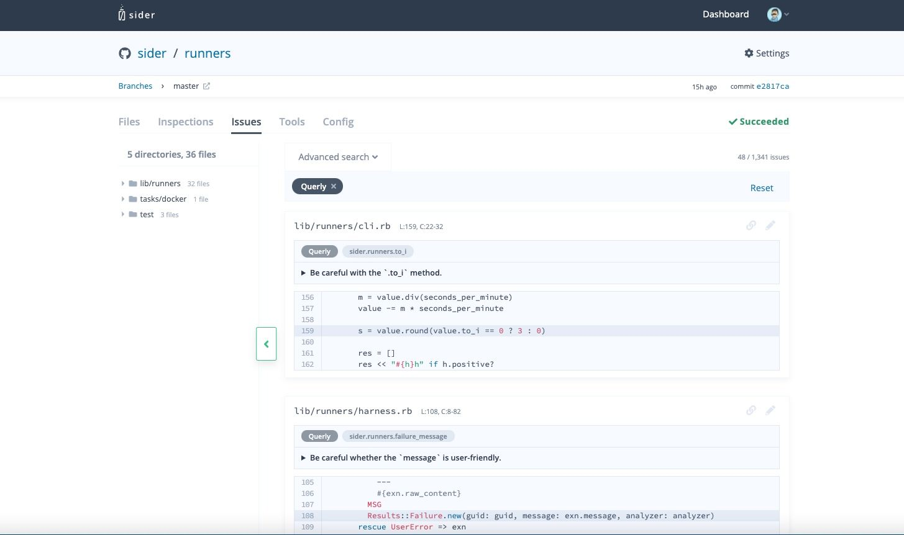

# Code Quality

Sider analyzes all files in a branch of your repositories and show the issues and code metrics for each file. It helps you understand the current quality of code and find which files need to be refactored.

## Branch Analysis

If you want to see the code quality of your repository, you need to start analysis manually or configure [Analysis Branches](../getting-started/repository-settings.md#branches).

To analyze your branch manually, open the dashboard of Sider and select a repository to analyze.

You will see the `Branches` tab at the top of the screen. And when you click the `Branches` tab, you will see the branch list of your repository.

Click the `Analyze` button on the right side of the branch that you want to analyze. After all analysis has been completed, you can see the issues and code metrics on the following tabs.

## Files

After analyzing the branch, you can see the details of the result when you click the branch.

On the `Files` tab, You can see the `Duplicates`, `Complexity`, `LOC`, `Issues` and `Last commit` for each file and directory.

- Duplicates: the total number of code duplicates in the file or the directory
- Complexity: the total complexity in the file or the maximum value in the directory
- LOC: the total lines of code in the file or the directory
- Issues: the total number of issues in the file or the directory
- Last commit: the last committed time of the file or of all files in the directory

On the `Files` tab, you can explore the directories, show the file content by clicking the file name and find issues highlighted in the code.

The detailed message of the issue will appear during the mouse hovers over the wavy lines. You can also make the message pinned by clicking the `View Problem` button on the hovering message.

So, the `Files` tab helps you to find easily which files or directories need to be refactored.

## Inspections

The `Inspections` tab visualizes the code quality of your entire repository. The charts on this tab show several code quality metrics versus how often code is changing (Churn). Plotted points on individual chart indicates files and metrics. The points are limited to the highest 30 of churn values.

- Churn: how many times and how much size a file has been changed in the specified period of time (90 days)

You can click a point to see its file name and metrics values on the indication area above the charts.

- Complexity: the total complexity in the file.
- Duplicates: code duplicates in the file. The chart shows the duplication ratio(sum of duplicated line / LOC).
- Issues: total amount of issues in the file. The chart shows the density of issues(number of issues / LOC).
- LOC: total lines of code in the file.

## Issues

On the `Issues` tab, you can see all issues found in a branch of your repository.

You can filter the issues by tools or severities using `Advanced search`, and also you can filter by file or directory using `Directory tree`.

## Analysis tools

Our analysis tools `Metrics Code Clone`, `Metrics Complexity`, and `Metrics File Info` of [Runners](https://github.com/sider/runners) are used to measure the code quality.

- Metrics Code Clone: measures the code duplication
- Metrics Complexity: measures the complexity
- Metrics File Info: measures the lines of code(LOC)
- Other tools selected at [Analysis tools](../getting-started/repository-settings.md#tools): measure the number of issues

The `Metrics Code Clone` and `Metrics Complexity` have the limitation of the languages. Check the following table. The `Metrics Code Clone` and `Metrics Complexity` can't generate results for files of unsupported languages.

| Language    | Metrics Code Clone | Metrics Complexity |
| ----------- | ------------------ | ------------------ |
| C++         | ✔️                 | ✔️                 |
| C#          | ✔️                 | ✔️                 |
| Fortran     | -                  | ✔️                 |
| GDScript    | -                  | ✔️                 |
| Golang      | ✔️                 | ✔️                 |
| Java        | ✔️                 | ✔️                 |
| JavaScript  | ✔️                 | ✔️                 |
| Kotlin      | ✔️                 | -                  |
| Lua         | -                  | ✔️                 |
| Objective-C | ✔️                 | ✔️                 |
| PHP         | ✔️                 | ✔️                 |
| Python      | ✔️                 | ✔️                 |
| Ruby        | ✔️                 | ✔️                 |
| Rust        | -                  | ✔️                 |
| Scala       | -                  | ✔️                 |
| Swift       | ✔️                 | ✔️                 |
| TTCN-3      | -                  | ✔️                 |
| TypeScript  | -                  | ✔️                 |
