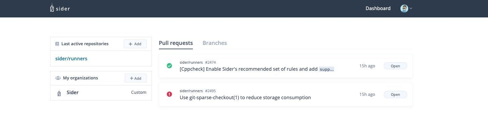
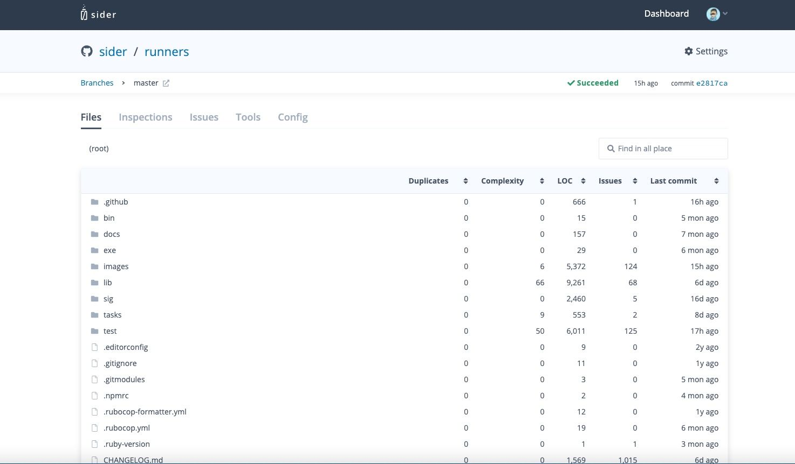

# Code Quality

You can analyze all files in the branch of the repository, and you can see the issues and code metrics for your code quality.

## Branch Analysis

If you want to see the code quality of your repository, you need to analyze your branch manually or configure [Analysis Branches](../getting-started/repository-settings#branches).

To analyze your branch manually, open the dashboard of the Sider and click the repository that you want to see the code quality.

You can see the `Branches` tab on the top of the screen. And when you click the `Branches` tab, you can see the branch list of your repository.

Click the `Analyze` button on the right side of the branch that you want to analyze. When the all analyzers are finished, you can see the issues and code metrics.

## Files

After analyzing the branch, you can see the details of the result when you click the branch.

On the `Files` tab, You can see the `Duplicates`, `Complexity`, `LOC`, `Issues` and `Last commit` by each files and directories.

- Duplicates: code duplicates in the files or directory
- Complexity: complexity in the file or maximum complexity in the directory
- LOC: total line of the code in the file or the directory
- Issues: total amount of the issues in the file or the directory
- Last commit: Last committed time in the file or the directory

On the `Files` tab, you can explore the directories, and you can see the file content with Issues when you click the file.

You can see the details of the issue when your mouse pointer hovers the wavy underline, and you can click `View Problem` to show the pinned message.

So, when you use the `Files` tab, you can find easily which files or directories are needed to refactor.

## Inspections

On the `Inspections` tab, you can see the code quality of your repository with visualization. The charts on the Inspections tab show quality metrics versus how often code is changing (churn). And points on individual charts are limited to the highest 30 of churn values.

You can click a point to see its file name and metrics values on the indication area.

- Complexity: complexity in the file.
- Duplicates: code duplicates in the file. The chart shows the duplication ratio(sum of duplicated line / LOC).
- Issues: total amount of issues in the file. The chart shows the density of issues(number of issues / LOC).
- LOC: total lines of code in the file.

## Issues

On the `Issues` tab, you can see all issues in your the branch of the repository.

You can filter the issues by tools or severities using `Advanced search`, and also you can filter by file or directory using `Directory tree`.
