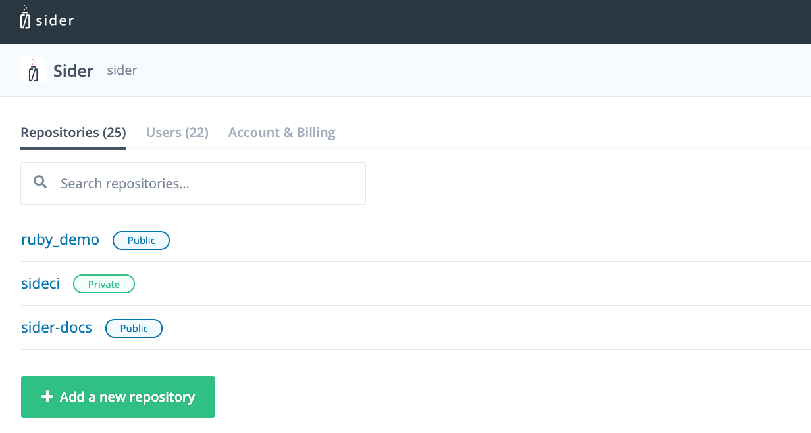
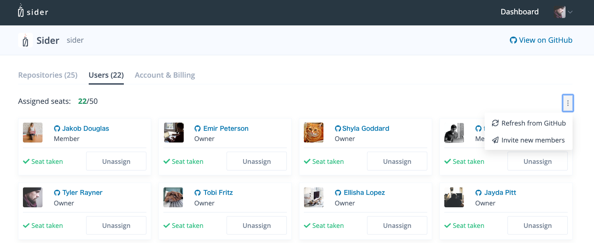

# Dashboard Overview

The Dashboard page gives an overview of the latest pull requests, last active repositories, and your organizations.

## Introduction Video

 <iframe class="Video__iframe" src="https://www.youtube.com/embed/TIQ61lCm6nI" frameborder="0" allowfullscreen></iframe>

## Latest Analysed Pull Requests

List issue cards containing the latest pull request passed into Sider. 

### Issue Cards
Contain information about a pull request and links to its analysis page.

**Icon:**

* **II** - Pull request is being analyzed

* **✓** - No issues with the pull request

* **×** - Pull request has issues
      
**Repository information:**

* Organization and repository
* Pull request number
* Title of Pull Request

**Pull request status:**
* Open
* Merged

**Time:**

* When the pull request was analyzed, relative to the current time.

## Last Active Repositories
Links to the last active repositories.

### Repository

Repository pages contain a history of pull request issue cards related to the repository.

## My Organizations

The **+Add** button adds additional organizations to the Sider account.

Organizations link to organizations connected to the Sider Account. 

## Organization Page

The organization page contains links to the organization's repositories, users and account & billing information.

### Repositories Tab

Search for repositories or add new repositories.

### Users Tab

See members with assigned seats. Admins will have the ability to assign seats and invite new users.

### Accounting & Billing Tab

Add additional seats, include billing details and track invoices in this section.

For more details look at [Billing and Plans](../billing-and-plans.md).