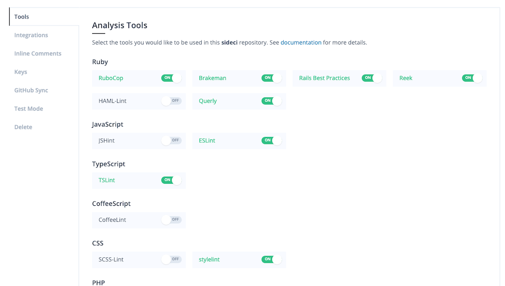
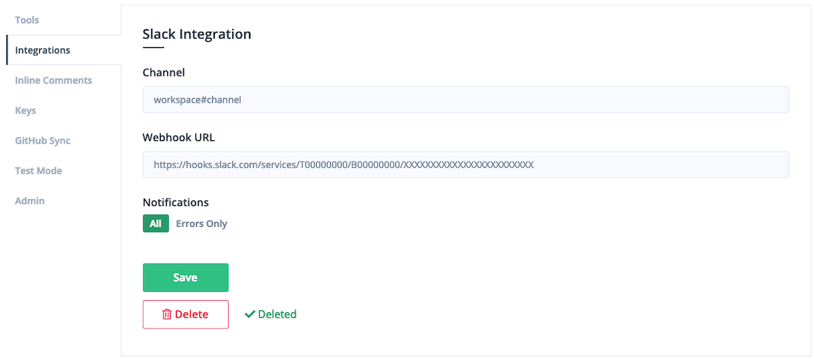
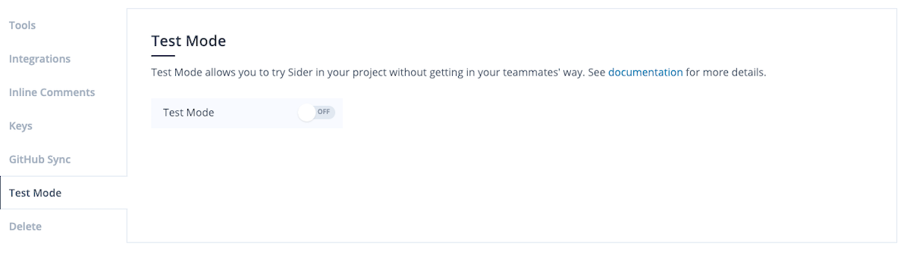

# Repository Settings

The Repository Settings page allows you to configure Sider's behavior for each repository. You will see the Repository Settings screen upon adding your repository to Sider.

You must have write permission to the repository to change these settings.

## Introduction Video

 <iframe class="Video__iframe" src="https://www.youtube.com/embed/D7e8YZDrqQY" frameborder="0" allowfullscreen></iframe>

## Tools

This section allows you to enable the analysis tool you would like to use. Tools that are enabled will be run against new pull requests in your repository.

## Branches

This section allows you to set any auto-analyzed branch that is not combined with a pull request.

When a commit is pushed to a branch you set, analysis of the commit automatically starts.
You can view all the issues of the whole repository, in contrast with pull request issues.

## Integrations

In this section, you can enable Slack notifications from Sider. Enter `team#channel` in the Name field and enter your Slack webhook url in the `URL` field.

In addition, if you wish not to receive notifications for analyses with no issue, choose `Errors Only`. Then, Sider will notify analysis results to your Slack channel only when it detects issues.

## Inline Comments

See [Inline Comments](../advanced-settings/inline-comments.md).

## Keys

See [Private Dependencies](../advanced-settings/private-dependencies.md).

## GitHub Sync

Sider will refresh your repository's information when the "Begin sync" button is clicked. If you have problems when operating Sider, click this button.

## Test Mode

This section allows you to enable Test Mode. If `ON`, Sider will send only success as a commit status.

## Notifications

This section allows you to enable or disable notifications via GitHub comments or emails.

If you enable **"On analysis failures"**, Sider will notify analysis failures due to invalid settings or linter's behavior.

## Admin-only Settings

> You must have admin permissions to see this section.

You can delete the repository from Sider in this section. Once deleted, Sider will delete your repository data including repository settings and analysis results and no longer analyze new pull requests. If you wish to re-enable Sider, re-add the repository from the "Add a new repository" screen.

See also [Restricting access to Close button](../advanced-settings/restricting-access-to-close-button.md).
