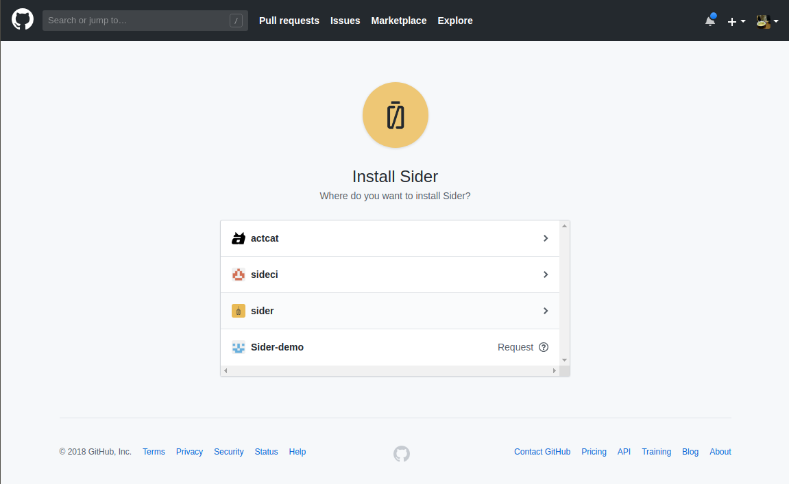
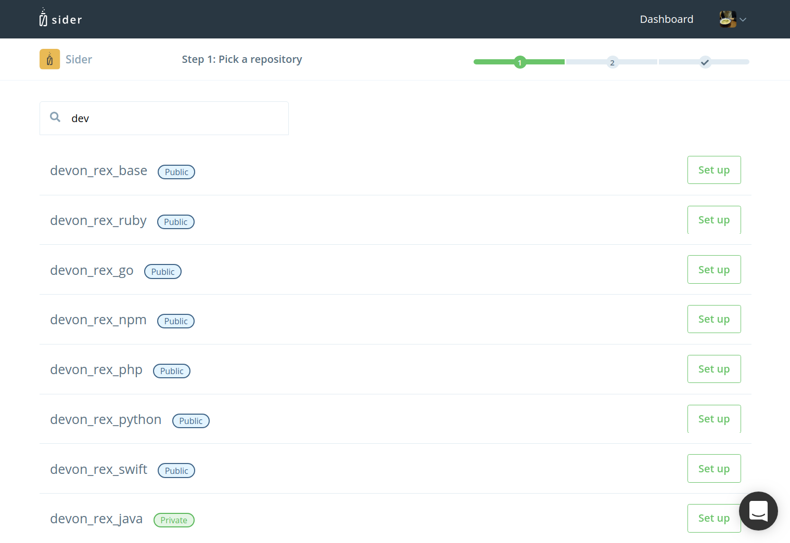
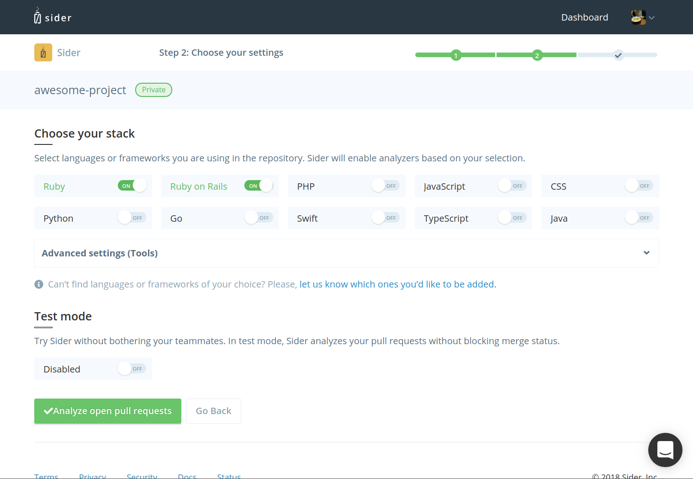

# Setting up Sider

## Sign Up

To sign up for Sider, click "Sign up via GitHub" on [sider.review](https://sider.review). Then, click "Authorize with GitHub". Sider will ask you for access to your repositories in order to analyze your code.

## Install Sider

Once you've authorized GitHub access, click "Add Organization", then you will be redirected to the installation page on GitHub.

NOTE: 14-day free trial starts when the app is installed.

## Select a Repository

After installation, select the repository you would like to add:

You must have [Admin access](https://help.github.com/articles/repository-permission-levels-for-an-organization/) to the repository in order to add it to Sider.

## Configure a Repository for Initial Code Review

On this screen, you can set up your repository:

Select whether you'd like to choose your project's stack and use Test Mode.

### Choose your stack

Select languages or frameworks that you're using in your project. The checked tools will be used during code analysis. Here's the full list of available tools:

| Language / Framework | Tools |
| :------------------- | :---- |
| Ruby | RuboCop, Reek |
| Ruby on Rails | RuboCop, Reek, Brakeman, Rails Best Practices, JSHint, stylelint, CoffeeLint |
| PHP | PHPMD |
| JavaScript | JSHint |
| CSS | stylelint |
| Java | PMD, Checkstyle |
| Python | Flake8 |
| Go | Golint, govet |
| Swift | SwiftLint |
| TypeScript | TSLint |

For more details, see Analysis Tools documentation from left sidebar.

### Test Mode

Test Mode allows you to try Sider in your project, without getting in your teammates' way. In Test Mode, Sider will not block you from merging pull requests, regardless of the analysis result. However, if you have enabled Inline Commenting for your repository, Sider will still post comments to pull requests while in Test Mode.

Click "Analyze open pull requests" to start analysis. Sider will analyze your 3 latest pull requests.

You will be able to fine-tune your project's configuration at any time after the initial analysis.

## Video Tutorial

 <iframe class="Video__iframe" src="https://www.youtube.com/embed/bCfgdf4cjcU" frameborder="0" allowfullscreen></iframe>

