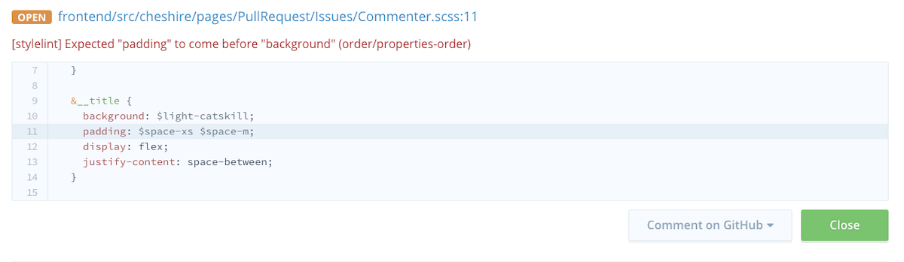
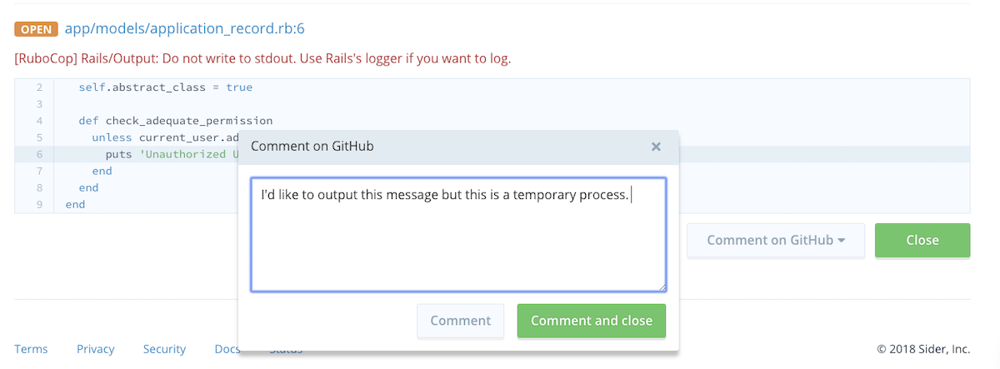

# Working with Issues

You can view all the issues Sider has found on a given pull request from the pull request page in Sider. This page also offers several handy ways to interact with issues, including ignoring issues and requesting feedback.

## Closing Issues
Sometimes, Sider will flag a piece of code that you may want to keep as-is. In this case, you can close the issue by clicking the green `Close` button. Sider will automatically ignore the issue when analyzing your pull request in the future.



Closed issues will still be visible on Sider (they will be greyed out to indicate they have been ignored). This way, your teammates can review closed issues later.

When there are no open issues left in the pull request, the commit status on GitHub will turn green.


If need be, you can reopen the issue after closing it.


## Requesting Feedback
If you are not sure whether an issue is a false positive or not, you can ask your teammates to help you figure it out. Click the `Comment` button to post a comment to GitHub.



You and your teammates can continue the discussion on GitHub.

## Reviewing Closed Issues
If there are any closed issues in your pull request, the commit status message will show as follows:

```
No issues left; 3 issues closed.
```

Make sure to carefully review all of the changes and double-check the issues that were closed on Sider.


If you see an issue you do not think should be ignored, click the `Reopen` button and ask the developer to fix it.

## Who Can Close Issues?
Sider decides whether to allow users to close issues based on their GitHub permissions. If a user does not have permission to push to the repository, Sider will not grant them permission to close issues.

* If a user has permission to push to the repository, Sider will assume they are qualified and experienced enough developers to judge which issues can be ignored safely.
* If developers are not allowed to push to the repository, Sider will assume they are junior developers and not allow them to close issues.

We believe this gives your team a good balance of control and flexibility.
