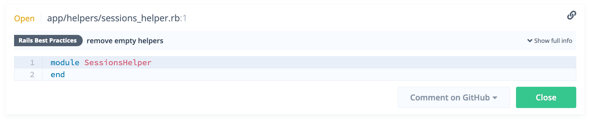

# Working with Issues

Although Sider needs all issues to be dealt with before passing status checks on GitHub, this doesn't mean that all issues need to be fixed. A combination of fixing or closing all issues will also pass status checks on GitHub.
All this can be done from the pull request's analysis results page in Sider. This page offers several ways to review issues, including fixing issues, closing issues and commenting on GitHub.

## Introduction Video

 <iframe class="Video__iframe" src="https://www.youtube.com/embed/A2CbtgI8_DY" frameborder="0" allowfullscreen></iframe>

## Fixing Issues

When there is an issue that needs to be fixed, make the changes and commit them to your pull request. Sider will analyze the pull request again and update the status of the issue.

 <iframe class="Video__iframe" src="https://www.youtube.com/embed/PBZU2Fw2k8A" frameborder="0" allowfullscreen></iframe>

## Closing Issues

Sometimes, Sider will flag a piece of code that you may want to keep as-is. In this case, you can close the issue by clicking the green `Close` button. Sider will automatically ignore the issue when analyzing your pull request in the future.

Closed issues will be greyed out on Sider. If need be, you can reopen the issue after closing it.

When there are no open issues left in the pull request, the commit status on GitHub will turn green.

## Commenting on GitHub

Reviewers can comment on issues directly onto the GitHub pull request page by clicking on the issue's `Comment on GitHub` button. You will need to give Sider authorization the first time you perform this action.

 <iframe class="Video__iframe" src="https://www.youtube.com/embed/16MuYzj_Ml0" frameborder="0" allowfullscreen></iframe>

## Requesting Feedback

If you are not sure whether an issue is a false positive or not, you can ask your teammates to help you figure it out. Click the `Comment on GitHub` button to post a comment to GitHub.

You and your teammates can continue the discussion on GitHub.

## Reviewing Closed Issues

If there are any closed issues in your pull request, the commit status message will show as follows:

Make sure to carefully review all the changes and double-check the issues that were closed on Sider.

If you see an issue you do not think should be ignored, click the yellow `Reopen` button and ask the developer to fix it.

## Who Can Close Issues?

By default, users with write or admin permissions can close issues.

You can also change this restriction to only users with admin permissions. See [Restricting access to Close button](../advanced-settings/restricting-access-to-close-button.md).

## How do I close many issues at once?

You can close all issues or filtered issues at once by clicking on `more` and selecting `Close all filtered issues`.

 <iframe class="Video__iframe" src="https://www.youtube.com/embed/vnwf6pVLtWM" frameborder="0" allowfullscreen></iframe>

