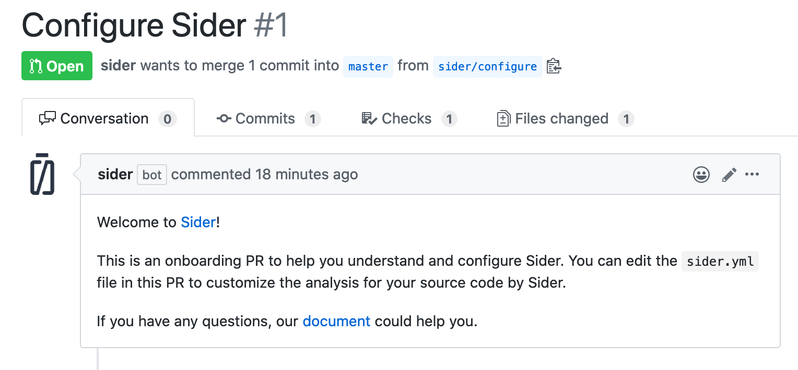

# News in 2020

This document describes notable changes on Sider in the year 2020.

---

## Support third-party dependencies with JVM tools

<time class="news-date" datetime="2020-08-04">August 4, 2020</time>

We have just supported third-party dependencies for JVM tools in this release!
This feature allows you to load third-party rules or plugins via `sider.yml`. For example:

```yaml
linter:
  checkstyle:
    jvm_deps:
      # [group, name, version] from Maven repositories
      - [com.github.sevntu-checkstyle, sevntu-checks, 1.37.1]
```

See the [`linter.<analyzer_id>.jvm_deps`](../getting-started/custom-configuration.md#linteranalyzer_idjvm_deps) for more details.

Also, with this release, the `cli`, `maven`, and `gradle` under `linter.ktlint` has been removed.
See the [ktlint](../tools/kotlin/ktlint.md) for details.

In addition, this release includes the following updates:

Environment:

- Node.js - 12.18.2 → **12.18.3**
- Git - 2.27.0 → **2.28.0**

Tool:

- JavaScript
  - [ESLint](../tools/javascript/eslint.md) - 7.5.0 → **7.6.0** ([changelog](https://github.com/eslint/eslint/blob/v7.6.0/CHANGELOG.md))
  - [JSHint](../tools/javascript/jshint.md) - 2.11.1 → **2.11.2** ([changelog](https://github.com/jshint/jshint/releases/tag/2.11.2))
- TypeScript
  - [TSLint](../tools/javascript/tslint.md) - 6.1.2 → **6.1.3** ([changelog](https://github.com/palantir/tslint/blob/6.1.3/CHANGELOG.md))
  - [TyScan](../tools/javascript/tyscan.md) - 0.3.1 → **0.3.2** ([release note](https://github.com/sider/TyScan/releases/tag/v0.3.2))

---

## Update languages and tools on July 28, 2020

<time class="news-date" datetime="2020-07-28">July 28, 2020</time>

We have updated the following languages and tools. Please check each tool's document for details.

Environment:

- Debian - buster-20200607 → **buster-20200720**
- Go - 1.14.4 → **1.14.6**
- Java - 14.0.1 → **14.0.2**
- npm - 6.14.6 → **6.14.7**
- PHP - 7.4.7 → **7.4.8**

Tool:

- C/C++
  - [cpplint](../tools/cplusplus/cpplint.md) - 1.5.2 → **1.5.3** ([changelog](https://github.com/cpplint/cpplint/blob/1.5.2/changelog.rst))
- Go
  - [GolangCI-Lint](../tools/go/golangci-lint.md) - 1.28.3 → **1.29.0** ([release note](https://github.com/golangci/golangci-lint/releases/tag/v1.29.0))
- Java
  - [Checkstyle](../tools/java/checkstyle.md) - 8.34 → **8.35** ([release note](https://checkstyle.org/releasenotes.html))
  - [PMD](../tools/java/pmd.md) - 6.25.0 → **6.26.0** ([release note](https://pmd.github.io/pmd-6.26.0/pmd_release_notes.html))
- JavaScript
  - [ESLint](../tools/javascript/eslint.md) - 7.4.0 → **7.5.0** ([changelog](https://github.com/eslint/eslint/blob/v7.5.0/CHANGELOG.md))
- Markdown
  - [remark-lint](../tools/markdown/remark-lint.md) - 8.0.0 → **8.0.1** ([release note](https://github.com/remarkjs/remark/releases/tag/remark-cli%408.0.1))
- Ruby
  - [RuboCop](../tools/ruby/rubocop.md) - 0.87.1 → **0.88.0** ([changelog](https://github.com/rubocop-hq/rubocop/blob/v0.88.0/CHANGELOG.md))
- Others
  - [PMD CPD](../tools/others/pmd-cpd.md) - 6.25.0 → **6.26.0** ([release note](https://pmd.github.io/pmd-6.26.0/pmd_release_notes.html))

---

## Clang-Tidy support and more

<time class="news-date" datetime="2020-07-16">July 16, 2020</time>

We are happy to announce that [Clang-Tidy](../tools/cplusplus/clang-tidy.md) is newly supported! 🎉

Clang-Tidy is a part of the [Clang](https://clang.llvm.org/) toolchain, and it can detect style violations, common bugs, etc. in C/C++ code.

In addition, this release includes the following updates:

Environment:

- Node.js - 12.18.0 → **12.18.2**
- Git - 2.20.1 → **2.27.0**

Tool:

- C/C++
  - [cpplint](../tools/cplusplus/cpplint.md) - 1.5.1 → **1.5.2** ([changelog](https://github.com/cpplint/cpplint/blob/1.5.2/changelog.rst))
- Go
  - [GolangCI-Lint](../tools/go/golangci-lint.md) - 1.27.0 → **1.28.3** ([release note](https://github.com/golangci/golangci-lint/releases/tag/v1.28.3))
- Java
  - [Checkstyle](../tools/java/checkstyle.md) - 8.33 → **8.34** ([release note](https://checkstyle.org/releasenotes.html))
  - [PMD](../tools/java/pmd.md) - 6.24.0 → **6.25.0** ([release note](https://pmd.github.io/pmd-6.25.0/pmd_release_notes.html))
- JavaScript
  - [ESLint](../tools/javascript/eslint.md) - 7.2.0 → **7.4.0** ([changelog](https://github.com/eslint/eslint/blob/v7.4.0/CHANGELOG.md))
- Kotlin
  - [detekt](../tools/kotlin/detekt.md) - 1.9.1 → **1.10.0** ([release note](https://detekt.github.io/detekt/changelog.html#1100))
- Ruby
  - [RuboCop](../tools/ruby/rubocop.md) - 0.85.1 → **0.87.1** ([changelog](https://github.com/rubocop-hq/rubocop/blob/v0.85.1/CHANGELOG.md))
- Others
  - [LanguageTool](../tools/others/languagetool.md) - 4.9.1 → **5.0** ([changelog](https://github.com/languagetool-org/languagetool/blob/v5.0/languagetool-standalone/CHANGES.md))
  - [PMD CPD](../tools/others/pmd-cpd.md) - 6.24.0 → **6.25.0** ([release note](https://pmd.github.io/pmd-6.25.0/pmd_release_notes.html))

Also, some tool options in `sider.yml` have been added, changed, and deprecated since this release.
Please see each tool's documentation for details.

---

## Update Rails Best Practices

<time class="news-date" datetime="2020-06-25">June 25, 2020</time>

We have updated [Rails Best Practices](../tools/ruby/rails-best-practices.md) to the latest version! 🚀

The version change is from 1.19.4 to **1.20.0**. Here is the [changelog](https://github.com/flyerhzm/rails_best_practices/blob/v1.20.0/CHANGELOG.md#1200-2020-02-29).

---

## Update languages and tools on June 18, 2020

<time class="news-date" datetime="2020-06-18">June 18, 2020</time>

We have updated the following languages and tools. Please each tool's document for details.

Highlight:

- Now the latest version of [**Brakeman**](../tools/ruby/brakeman.md) is available! 🎉
- The [`bug-hunting`](../tools/cplusplus/cppcheck.md#bug-hunting) option of Cppcheck is newly supported.
- Analysis of [multiple languages](../tools/others/pmd-cpd.md#language) in PMD CPD is newly supported.

Language:

- Go - 1.14.3 → **1.14.4**
- Node.js - 12.16.3 → **12.18.0**
- PHP - 7.4.6 → **7.4.7**
- Swift - 5.2.3 → **5.2.4**

Tool:

- C/C++
  - [Cppcheck](../tools/cplusplus/cppcheck.md) - 2.0 → **2.1** ([release note](https://github.com/danmar/cppcheck/releases/tag/2.1))
  - [cpplint](../tools/cplusplus/cpplint.md) - 1.4.5 → **1.5.1** ([changelog](https://github.com/cpplint/cpplint/blob/1.5.1/changelog.rst))
- CSS
  - [stylelint](../tools/css/stylelint.md) - 13.4.1 → **13.6.1** ([changelog](https://stylelint.io/changelog))
- Dockerfile
  - [hadolint](../tools/dockerfile/hadolint.md) - 1.17.6 → **1.18.0** ([release note](https://github.com/hadolint/hadolint/releases/tag/v1.18.0))
- Java
  - [Checkstyle](../tools/java/checkstyle.md) - 8.32 → **8.33** ([release note](https://checkstyle.org/releasenotes.html))
  - [PMD](../tools/java/pmd.md) - 6.23.0 → **6.24.0** ([release note](https://pmd.github.io/pmd-6.24.0/pmd_release_notes.html))
- JavaScript
  - [ESLint](../tools/javascript/eslint.md) - 6.8.0 → **7.2.0** ([changelog](https://github.com/eslint/eslint/blob/v7.2.0/CHANGELOG.md))
- Kotlin
  - [ktlint](../tools/kotlin/ktlint.md) - 0.36.0 → **0.37.2** ([changes](https://github.com/pinterest/ktlint/releases/tag/0.37.2))
- Python
  - [Flake8](../tools/python/flake8.md) - 3.8.1 → **3.8.3** ([release note](https://flake8.pycqa.org/en/latest/release-notes/))
  - [Pylint](../tools/python/pylint.md) - 2.5.2 → **2.5.3** ([changelog](https://github.com/PyCQA/pylint/blob/pylint-2.5.3/ChangeLog))
- Ruby
  - [Brakeman](../tools/ruby/brakeman.md) - 4.3.1 → **4.8.2** ([changelog](https://github.com/presidentbeef/brakeman/blob/v4.8.2/CHANGES.md))
  - [Reek](../tools/ruby/reek.md) - 6.0.0 → **6.0.1** ([changelog](https://github.com/troessner/reek/blob/v6.0.1/CHANGELOG.md))
  - [RuboCop](../tools/ruby/rubocop.md) - 0.83.0 → **0.85.1** ([changelog](https://github.com/rubocop-hq/rubocop/blob/v0.85.1/CHANGELOG.md))
- Others
  - [PMD CPD](../tools/others/pmd-cpd.md) - 6.23.0 → **6.24.0** ([release note](https://pmd.github.io/pmd-6.24.0/pmd_release_notes.html))

---

## New PMD CPD support

<time class="news-date" datetime="2020-06-08">June 8, 2020</time>

We are happy to announce that [PMD CPD](../tools/others/pmd-cpd.md) is newly supported! (yet beta) 🎉

This tool is a "Copy/Paste Detector" to find duplicate code in multiple languages like Java, Ruby, Python, and so on.
It is disabled by default, so please enable it in your repository settings if you want to use it.

---

## New Pylint support

<time class="news-date" datetime="2020-05-29">May 29, 2020</time>

We are happy to announce that [Pylint](../tools/python/pylint.md) is newly supported! (yet beta) 🎉

This tool can detect programming errors, help to enforce a coding standard, look for code smells, and offer simple refactoring suggestions in Python files, so it will surely help your code-review.
It is disabled by default, so if you want to use, then please enable it in your repository settings.

---

## Support `addon` option for Cppcheck

<time class="news-date" datetime="2020-05-25">May 25, 2020</time>

We have newly supported the [`addon`](../tools/cplusplus/cppcheck.md#addon) option for [Cppcheck](../tools/cplusplus/cppcheck.md).
The option can provide the additional predefined rules.

Also, Cppcheck has been updated from 1.90 to **2.0**. See the [changes](https://github.com/danmar/cppcheck/releases/tag/2.0) for details.

---

## Update languages and tools on May 20, 2020

<time class="news-date" datetime="2020-05-20">May 20, 2020</time>

Language:

- Go - 1.14.2 → **1.14.3**
- PHP - 7.4.5 → **7.4.6**

Tool:

- CSS
  - [stylelint](../tools/css/stylelint.md) - 13.3.3 → **13.4.1** ([changelog](https://stylelint.io/changelog))
- Go
  - [GolangCI-Lint](../tools/go/golangci-lint.md) - 1.26.0 → **1.27.0** ([release note](https://github.com/golangci/golangci-lint/releases/tag/v1.27.0))
- JavaScript
  - [JSHint](../tools/javascript/jshint.md) - 2.11.0 → **2.11.1** ([changes](https://github.com/jshint/jshint/releases/tag/2.11.1))
- Kotlin
  - [detekt](../tools/kotlin/detekt.md) - 1.8.0 → **1.9.1** ([release note](https://detekt.github.io/detekt/changelog.html#191))
- Ruby
  - [Querly](../tools/ruby/querly.md) - 1.0.0 → **1.1.0** ([changes](https://github.com/soutaro/querly/blob/v1.1.0/CHANGELOG.md#110-2020-05-17))
  - [RuboCop](../tools/ruby/rubocop.md) - 0.82.0 → **0.83.0** ([changelog](https://github.com/rubocop-hq/rubocop/blob/v0.83.0/CHANGELOG.md#0830-2020-05-11))
- Python
  - [Flake8](../tools/python/flake8.md) - 3.7.9 → **3.8.1** ([release note](https://flake8.pycqa.org/en/latest/release-notes/))

If you have any questions or feedback, feel free to ask us via chat.

---

## Create `sider.yml` when a repository is added

<time class="news-date" datetime="2020-05-14">May 14, 2020</time>

We have just released a new feature to automatically creates `sider.yml` via a pull request! 🎉

1. When you try adding your repository newly, you can see the following new checkbox:

   

2. When you check it and click the "Start..." button, the following pull request is created into the added repository:

   

You can enjoy the new feature if you **accept new GitHub permission**¹ that is requested.

If you have any questions or feedback, feel free to ask us via chat.

¹ _If you do not want to use the feature, please ignore the permission request._

---

## New LanguageTool support and more

<time class="news-date" datetime="2020-05-14">May 14, 2020</time>

We are happy to announce that [LanguageTool](../tools/others/languagetool.md) is newly supported! 🎉

This tool is for natural languages like English or French, and it can detect typos or grammar mistakes and so on.
We recommend using it for documents like Markdown. Try it!

### FxCop improvements

Since this release, [FxCop](../tools/csharp/fxcop.md) has provided a static code analysis without a build,
which makes it easier to analyze your C# code. Try it!

### Recommended migration to GolangCI-Lint

As announced earlier, [Golint](../tools/go/golint.md), [Govet](../tools/go/govet.md), and [Go Meta Linter](../tools/go/gometalinter.md) will be stopped at the end of this month.
Most repositories using the 3 tools above can easily migrate to [GolangCI-Lint](../tools/go/golangci-lint.md) now. We strongly recommend the migration as soon as possible.

### Languages and tools update on May 14, 2020

Also, this release updates the following languages and tools.

Language:

- Go - 1.14.1 → **1.14.2**
- Java - 12.0.2 → **14.0.1**
- Node.js - 12.16.1 → **12.16.3**
- PHP - 7.4.4 → **7.4.5**
- Python - 3.7.4 → **3.8.2**
- Ruby - 2.6.6 → **2.7.1**
- Swift - 5.1.5 → **5.2.3**

Tool:

- C#
  - [FxCop](../tools/csharp/fxcop.md) - 2.9.8 → **3.0.0** ([release note](https://github.com/dotnet/roslyn-analyzers/releases/tag/v3.0.0))
- CSS
  - [stylelint](../tools/css/stylelint.md) - 13.2.0 → **13.3.3** ([changelog](https://stylelint.io/changelog))
- Dockerfile
  - [hadolint](../tools/dockerfile/hadolint.md) - 1.17.5 → **1.17.6** ([release note](https://github.com/hadolint/hadolint/releases/tag/v1.17.6))
- Go
  - [GolangCI-Lint](../tools/go/golangci-lint.md) - 1.24.0 → **1.26.0** (release note: [1.25.0](https://github.com/golangci/golangci-lint/releases/tag/v1.25.0), [1.26.0](https://github.com/golangci/golangci-lint/releases/tag/v1.26.0))
- Java
  - [Checkstyle](../tools/java/checkstyle.md) - 8.30 → **8.32** ([release note](https://checkstyle.org/releasenotes.html))
  - [PMD](../tools/java/pmd.md) - 6.21.0 → **6.23.0** (release note: [6.22.0](https://pmd.github.io/2020/03/12/PMD-6.22.0/), [6.23.0](https://pmd.github.io/2020/04/24/PMD-6.23.0/))
- Kotlin
  - [detekt](../tools/kotlin/detekt.md) - 1.7.0 → **1.8.0** ([release note](https://detekt.github.io/detekt/changelog.html#180))
- Markdown
  - [remark-lint](../tools/markdown/remark-lint.md) - 7.0.1 → **8.0.0** ([release note](https://github.com/remarkjs/remark/releases/tag/remark-cli%408.0.0))
- PHP
  - [PHP_CodeSniffer](../tools/php/code-sniffer.md) - 3.5.4 → **3.5.5** ([release note](https://github.com/squizlabs/PHP_CodeSniffer/releases/tag/3.5.5))
- Ruby
  - [Reek](../tools/ruby/reek.md) - 5.6.0 → **6.0.0** ([changelog](https://github.com/troessner/reek/blob/v6.0.0/CHANGELOG.md#600-2020-03-30))
  - [RuboCop](../tools/ruby/rubocop.md) - 0.80.1 → **0.82.0** ([changelog](https://github.com/rubocop-hq/rubocop/blob/v0.82.0/CHANGELOG.md#0820-2020-04-16))
- Shell script
  - [ShellCheck](../tools/shellscript/shellcheck.md) - 0.7.0 → **0.7.1** ([release note](https://github.com/koalaman/shellcheck/releases/tag/v0.7.1))
- Swift
  - [SwiftLint](../tools/swift/swiftlint.md) - 0.39.1 → **0.39.2** ([release note](https://github.com/realm/SwiftLint/releases/tag/0.39.2))
- TypeScript
  - [TSLint](../tools/javascript/tslint.md) - 6.0.0 → **6.1.2** ([changelog](https://github.com/palantir/tslint/blob/6.1.2/CHANGELOG.md#v612))
- Others
  - [Goodcheck](../tools/others/goodcheck.md) - 2.5.0 → **2.5.1** ([changelog](https://github.com/sider/goodcheck/blob/v2.5.1/CHANGELOG.md#251-2020-03-09))

If you have any questions or feedback, feel free to ask us via chat.

---

## New remark-lint support and more

<time class="news-date" datetime="2020-03-25">March 25, 2020</time>

We are happy to announce that [remark-lint](../tools/markdown/remark-lint.md) is newly supported! 🎉

This tool can detect possible mistakes in Markdown files, so it will surely help your code-review.
It is disabled by default, so if you want to use, then please enable it in your repository settings.

### New Reek options

In this release, we have added the `target` and `config` options for [Reek](../tools/ruby/reek.md).

### Languages and tools update on March 25, 2020

Also, the following languages and tools have been updated:

Language:

- Go - 1.14.0 → **1.14.1**
- PHP - 7.4.3 → **7.4.4**
- Swift - 5.1.4 → **5.1.5**

Tool:

- C/C++
  - [cpplint](../tools/cplusplus/cpplint.md) - 1.4.4 → **1.4.5** ([changes](https://github.com/cpplint/cpplint/compare/1.4.4...1.4.5))
- Dockerfile
  - [hadolint](../tools/dockerfile/hadolint.md) - 1.17.4 → **1.17.5** ([changes](https://github.com/hadolint/hadolint/compare/v1.17.4...v1.17.5))
- Go
  - [GolangCI-Lint](../tools/go/golangci-lint.md) - 1.23.6 → **1.24.0** ([changes](https://github.com/golangci/golangci-lint/compare/v1.23.6...v1.24.0))
- Kotlin
  - [detekt](../tools/kotlin/detekt.md) - 1.6.0 → **1.7.0** ([changes](https://github.com/arturbosch/detekt/compare/1.6.0...1.7.0))

If you have any questions or feedback, please contact us via chat.

---

## Newly support for GolangCI-Lint, detekt, and FxCop

<time class="news-date" datetime="2020-03-05">March 5, 2020</time>

We are happy to announce the big news! The following tools are newly supported (yet beta): 🎉

- [GolangCI-Lint](../tools/go/golangci-lint.md) (for Go)
- [detekt](../tools/kotlin/detekt.md) (for Kotlin)
- [FxCop](../tools/csharp/fxcop.md) (for C#)

The tools above are disabled by default. If you want to try, please enable them on your repository settings.

### Deprecated Go tools

This newly GolangCI-Lint support makes the following other Go tools **deprecated**:

- [go vet](../tools/go/govet.md) (included in GolangCI-Lint)
- [Golint](../tools/go/golint.md) (included in GolangCI-Lint)
- [Go Meta Linter](../tools/go/gometalinter.md) (the successor is GolangCI-Lint)

The deadline is scheduled for **April 30, 2020**. Please consider the migration as soon as possible.

### Deprecated TSLint

The TSLint team has marked TSLint deprecated on the [version 6.0.0](https://github.com/palantir/tslint/releases/tag/6.0.0) and decided to stop the activity on Dec 2020 (see the [discussion](https://github.com/palantir/tslint/issues/4534) for details).

So, we also have marked our [TSLint](../tools/javascript/tslint.md) support **deprecated**. We will continue to support it for a while, but we **strongly recommend** the migration to [TypeScript ESLint](https://github.com/typescript-eslint/typescript-eslint).

### More strict `sider.yml`

This release has made it more strict the schema checking of [`sider.yml`](../getting-started/custom-configuration.md).
For example:

```yaml
# Before; it is ignored and an analysis passes. 🙆
rubocop:
  # some options...
```

```yaml
# After; it is forbidden and an analysis fails! 🙅
linter:
  rubocop:
    # some options...
```

If you notice an error due to your invalid `sider.yml`, please confirm the error message and fix it.
We could help you via our chat support if you would be hard to fix.

### Languages and tools update on March 2020

We have updated the following languages and tools as usual.

Language:

- Node.js - 12.14.1 → **12.16.1**
- Go - 1.13.7 → **1.14.0**
- PHP - 7.4.2 → **7.4.3**

Tool:

- Ruby
  - [RuboCop](../tools/ruby/rubocop.md) - 0.80.0 → **0.80.1** ([changes](https://github.com/rubocop-hq/rubocop/blob/v0.80.1/CHANGELOG.md#0801-2020-02-29))
  - [HAML-Lint](../tools/ruby/haml-lint.md) - 0.34.2 → **0.35.0** ([changes](https://github.com/sds/haml-lint/blob/v0.35.0/CHANGELOG.md#0350))
- Java
  - [Checkstyle](../tools/java/checkstyle.md) - 8.29 → **8.30** ([changes](https://checkstyle.org/releasenotes.html#Release_8.30))
- PHP
  - [PHPMD](../tools/php/phpmd.md) - 2.8.1 → **2.8.2** ([changes](https://github.com/phpmd/phpmd/releases/tag/2.8.2))
- CSS
  - [stylelint](../tools/css/stylelint.md) - 13.0.0 → **13.2.0** ([changes](https://github.com/stylelint/stylelint/blob/13.2.0/CHANGELOG.md#1320))
- Swift
  - [SwiftLint](../tools/swift/swiftlint.md) - 0.38.2 → **0.39.1** ([changes](https://github.com/realm/SwiftLint/blob/0.39.1/CHANGELOG.md#0391-the-laundromat-has-a-rotating-door))
- Others
  - [Goodcheck](../tools/others/goodcheck.md) - 2.4.5 → **2.5.0** ([changes](https://github.com/sider/goodcheck/blob/v2.5.0/CHANGELOG.md#250-2020-02-27))
    - The feature to disable with inline comments is supported! See the [document](https://github.com/sider/goodcheck#disabling-rules-with-inline-comments) for details.

---

## Update the default version of RuboCop to 0.80.0

<time class="news-date" datetime="2020-02-19">February 19, 2020</time>

Yesterday, [RuboCop 0.80.0](https://github.com/rubocop-hq/rubocop/releases/tag/v0.80.0) has been released!
This release includes some breaking changes, so today we have updated our default version of RuboCop.

This does not affect repositories that use their own version of RuboCop defined in `Gemfile.lock` or `sider.yml`.

See also our [RuboCop document](../tools/ruby/rubocop.md).

---

## Update languages and tools on Feb 13, 2020

<time class="news-date" datetime="2020-02-13">February 13, 2020</time>

We have updated the following languages and tools.

Language:

- Node.js - 12.14.0 → **12.14.1**
- Go - 1.13.5 → **1.13.7**
- PHP - 7.4.1 → **7.4.2**
- Swift - 5.1.3 → **5.1.4**

Tool:

- Ruby
  - [RuboCop](../tools/ruby/rubocop.md)
    - Support plugins maintained by [rubocop-hq](https://github.com/rubocop-hq) by default ([sider/runners#682](https://github.com/sider/runners/issues/682))
    - Drop the 0.60.0 and older versions of RuboCop ([sider/runners#131](https://github.com/sider/runners/issues/131))
  - [Reek](../tools/ruby/reek.md) - 5.5.0 → **5.6.0** ([changes](https://github.com/troessner/reek/blob/v5.6.0/CHANGELOG.md#560-2020-01-20))
  - [HAML-Lint](../tools/ruby/haml-lint.md) - 0.34.0 → **0.34.2** ([changes](https://github.com/sds/haml-lint/blob/v0.34.2/CHANGELOG.md#0342))
- Swift
  - [SwiftLint](../tools/swift/swiftlint.md) - 0.38.0 → **0.38.2** ([changes](https://github.com/realm/SwiftLint/releases/tag/0.38.2))
- Java
  - [Checkstyle](../tools/java/checkstyle.md) - 8.28 → **8.29** ([changes](https://checkstyle.org/releasenotes.html#Release_8.29))
  - [PMD](../tools/java/pmd.md) - 6.20.0 → **6.21.0** ([changes](https://pmd.github.io/pmd-6.21.0/pmd_release_notes.html))
- TypeScript
  - [TSLint](../tools/javascript/tslint.md) - 5.20.1 → **6.0.0**
- JavaScript
  - [JSHint](../tools/javascript/jshint.md) - 2.10.3 → **2.11.0** ([changes](https://github.com/jshint/jshint/releases/tag/2.11.0))
  - [ESLint](../tools/javascript/eslint.md)
    - Drop the 4.19.1 and older versions of ESLint ([sider/runners#715](https://github.com/sider/runners/issues/715))
- CSS
  - [stylelint](../tools/css/stylelint.md) - 12.0.1 → **13.0.0** ([changes](https://github.com/stylelint/stylelint/releases/tag/13.0.0))

---

## Beta support for Dockerfile

<time class="news-date" datetime="2020-01-23">January 23, 2020</time>

Sider has started to support Dockerfile with [hadolint](../tools/dockerfile/hadolint.md).
If you are interested in the tool, please enable it in your [repository settings](../getting-started/repository-settings.md).

---

## Update languages and tools on Jan 8, 2020

<time class="news-date" datetime="2020-01-08">January 8, 2020</time>

We have updated the following languages and tools.

Language:

- Java - 12.0.1 → **12.0.2**
- Swift - 5.1.2 → **5.1.3**
- PHP - 7.4.0 → **7.4.1**
- Node.js - 12.13.1 → **12.14.0**

Tool:

- C/C++
  - [Cppcheck](../tools/cplusplus/cppcheck.md) - 1.89 → **1.90** ([changes](https://github.com/danmar/cppcheck/releases/tag/1.90))
- Java
  - [Checkstyle](../tools/java/checkstyle.md) - 8.27 → **8.28** ([changes](https://checkstyle.org/releasenotes.html#Release_8.28))
- Kotlin
  - [ktlint](../tools/kotlin/ktlint.md) - 0.35.0 → **0.36.0** ([changes](https://github.com/pinterest/ktlint/releases/tag/0.36.0))
- JavaScript
  - [ESLint](../tools/javascript/eslint.md) - 6.7.2 → **6.8.0** ([changes](https://eslint.org/blog/2019/12/eslint-v6.8.0-released))
- CSS
  - [stylelint](../tools/css/stylelint.md) - 12.0.0 → **12.0.1** ([changes](https://github.com/stylelint/stylelint/releases/tag/12.0.1))
- PHP
  - [PHPMD](../tools/php/phpmd.md) - 2.7.0 → **2.8.1**
    - [2.8.1](https://github.com/phpmd/phpmd/releases/tag/2.8.1)
    - [2.8.0](https://github.com/phpmd/phpmd/releases/tag/2.8.0)
  - [PHP_CodeSniffer](../tools/php/code-sniffer.md) - 3.5.2 → **3.5.3** ([changes](https://github.com/squizlabs/PHP_CodeSniffer/releases/tag/3.5.3))
- Ruby
  - [RuboCop](../tools/ruby/rubocop.md) - 0.78.0 → **0.79.0** ([changes](https://github.com/rubocop-hq/rubocop/releases/tag/v0.79.0))
