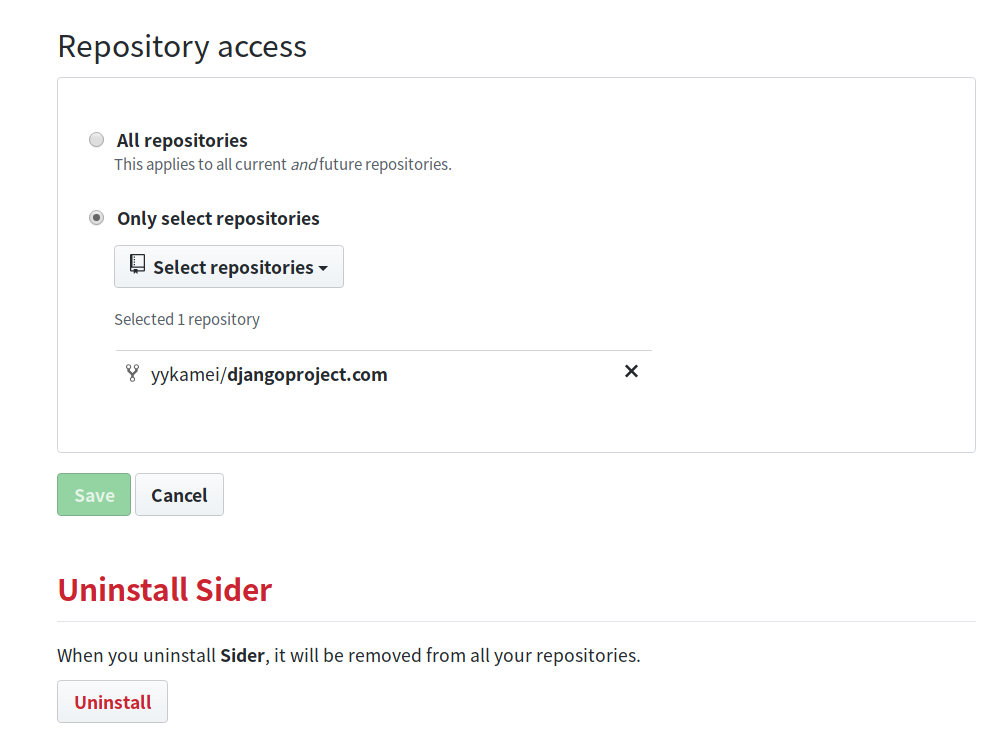
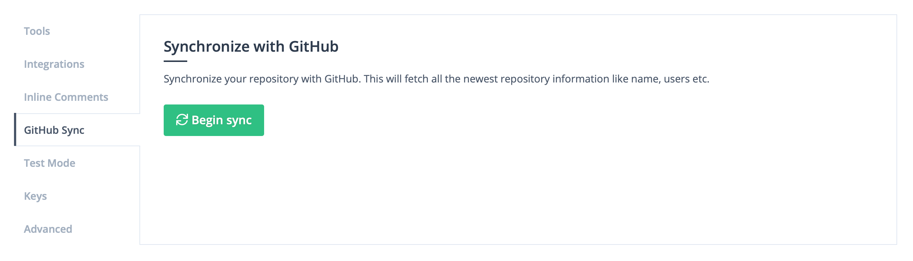

# Troubleshooting

## I cannot find my organization

This may be because Sider does not have access to your organization on GitHub. You can solve this problem by granting Sider access permission to your organization on GitHub shown as the following:

1. In your [Personal settings](https://github.com/settings/applications) on GitHub, proceed `Applications`, then open `Authorized OAuth Apps`, and select _Sider_.
2. Find your organizations in the `Organization access`.
3. Click `Grant`.

## I cannot find my repositories when trying to add a repository to Sider

If your organization has migrated to GitHub Apps, you must include your repositories in the "Repository access" section on GitHub.
Visit the [Sider installation page](https://github.com/apps/sider/installations/new) and select your organization. From there, you can configure repository access for your organization.



## I cannot add my repository

Users who can add their repository must have admin permission for the repository. This page helps you to configure your organization registration in Sider.

## I would like to assign seats to my teammates, but could not find them

Check whether GitHub users you would like to assign seats for already have accounts for Sider. If they have already signed up, synchronizing with GitHub will make them appear in organization settings page. You can synchronize with GitHub by trying either of following:

- From the Organization settings page, click the **Refresh from GitHub** button under the **Users** tab.
- Click the **Begin sync** button in the Repository settings page.

### Refresh button in Organization settings page


### Refresh button in Repository settings page



## How can I change repository settings?

Sign in [sider.review](https://sider.review) and select repository page you would like to change settings. And click `Repository Settings` in the left column. Then, you can change your repository settings such as the following:

- Selecting analysis tools
- Setting notification
- Switching modes

Please note that you must have a write permission to the repository in order to disable repository.

You can also disable Sider for the repository if you are an admin of the repository.

## Why did a pull request fail to checkout?

In many cases, the checkout failed will be resolved by retrying. However, if the error occurs in spite of several retries, the cause of the error is possible that the analyses have been taken a lot of time.

You can ignore specific files to fix the problem. Write the settings to `sider.yml` like below:

```yaml
linter:
  ignore:
    - "*.pdf"
    - "*.mp4"
```

## Analysis never starts

It might be because of the following situations:

### A pull request's author does not have a seat

A pull request's author must sign up to Sider and be assigned a seat by organization admins.
Unless the condition is satisfied, an analysis never starts.
To solve the problem, we recommend you to try the following:

1. Assign a seat to the pull request's author that has signed up to Sider.
2. Push a new commit to the pull request.

### Too many changed files in a pull request

The maximum number of changed files in a pull request is **3,000** in Sider.
An analysis never starts if your changed files exceed the limit.
