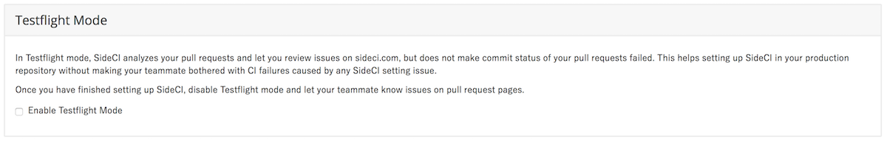
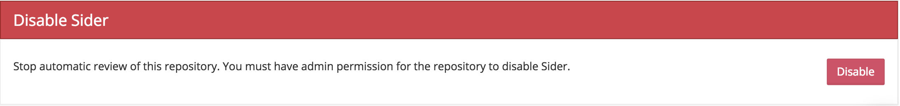

# Repository Settings

The Repository Settings page allows you to configure Sider's behavior for each repository. You will see the Repository Settings screen upon adding your repository to Sider.

You must have write permission to the repository to change these settings.

## Analyzer Settings

This section allows you to enable the analyzers you would like to use. Tools that are enabled will be run against new pull requests in your repository.

## Slack Notification

In this section, you can enable Slack notifications from Sider. Enter `team#channel` in the Name field and enter your Slack webhook url in the `URL` field.

## Test Mode

This section allows you to enable Test Mode.

## Disable Sider

You can disable Sider for the repository in this section. Once disabled, Sider will no longer analyze new pull requests. If you wish to re-enable Sider, re-add the repository from the "Add Repository" screen.


You must have admin permissions to disable Sider.


