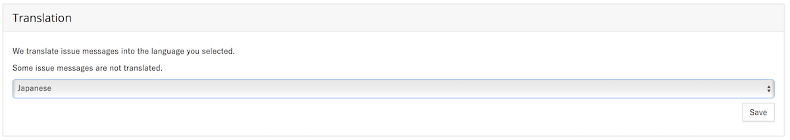

# Repository Settings

This page is a guide for configuring your repository. You will see the repository setting screen upon enabling your repository on Sider.

You must have write permission for the repository to change these settings.

## Analyzer Settings

These checkboxes allow you to enable analyzers you would like to use. The tools become available once you have checked them.

## Slack Notification

In this section, you can enable Slack notifications from Sider. Set `team#channel` as Name and register webhook as URL.

## Test Mode

This section allows you to enable Test mode.

## Translate

This section allows you to choose whether to enable issue contents translation to Japanese.

## Disable Sider

You can disable Sider for the repository in this section. Once you have disabled it, Sider will stop analysis. When you wish to re-enable Sider, add the repository from the "Add Repository" screen.


You must have admin permissions to disable Sider.


