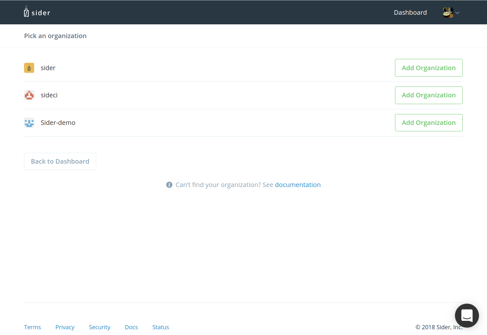
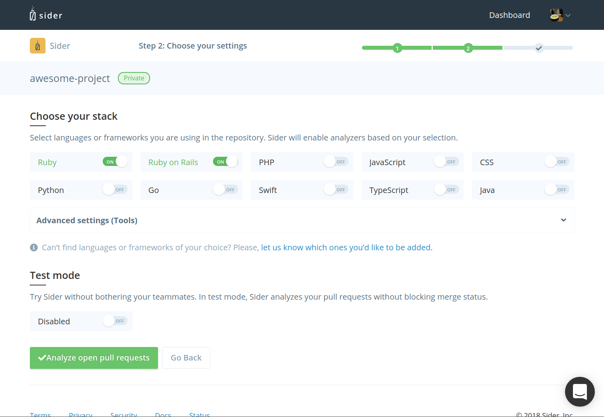

# Setting up Sider

## Sign Up

To sign up for Sider, click "Sign in via GitHub" on our homepage. Then, click "Authorize with GitHub". Sider will ask you for access to your repositories in order to analyze your code.

## Add a new Organization

Once you've authorized GitHub access, you will land on the welcome page. From here you can add an new organization as follows:

Please note that in order to add an organization you need to be an [owner](https://help.github.com/articles/permission-levels-for-an-organization/) of that organization on GitHub. If you cannot find the organization you would like to add, Sider may not be able to access your GitHub organization. See [troubleshooting guide](../troubleshooting#i-cannot-find-my-organization).

## Select a Repository

After adding the organization, select the repository you would like to add:

You must have [Admin access](https://help.github.com/articles/repository-permission-levels-for-an-organization/) to the repository in order to add it to Sider.

## Configure a Repository for Initial Code Review

On this screen, you can set up your repository:

Select whether to you'd like to use Test Mode and choose your project's stack.

### Choose your stack

Select languages or frameworks that you're using in your project. The checked tools will be used during code analysis. Here's the full list of available tools:

| Language / Framework | Tools |
| :------------------- | :---- |
| Ruby | RuboCop, Reek |
| Ruby on Rails | RuboCop, Reek, Brakeman, Rails Best Practices, JSHint, stylelint, CoffeeLint |
| PHP | PHPMD |
| JavaScript | JSHint |
| CSS | stylelint |
| Java | PMD, Checkstyle |
| Python | Flake8 |
| Go | Golint, govet |
| Swift | SwiftLint |
| TypeScript | TSLint |

### Test Mode

Test Mode allows you to try Sider in your project, without getting in your teammates' way. In Test Mode, Sider will not block you from merging pull requests, regardless of the analysis result. However, if you have enabled Inline Commenting for your repository, Sider will still post comments to pull requests while in Test Mode.

Click "Analyze open pull requests" to start analysis. Sider will analyze your 3 latest pull requests. If the project is in a private repository, clicking the button will start your 14-day free trial.

You will be able to fine-tune your project's configuration at any time after the initial analysis.
