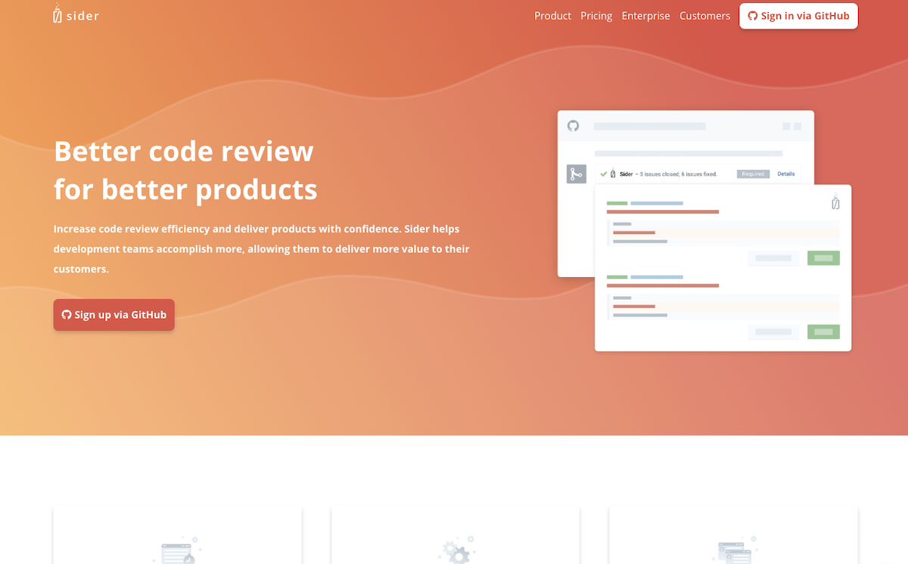
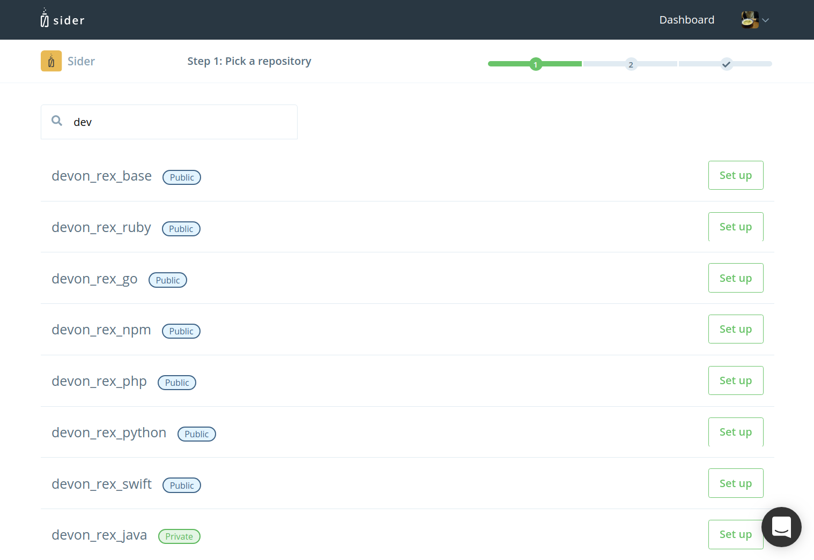

# Setting up Sider

## Sign Up

To sign up for Sider, click "Sign in via GitHub" on our homepage. Then, click "Authorize with GitHub". Sider will ask you for access to your repositories in order to analyze your code.

## Select a Repository

Once you've authorized GitHub access, you will see the following page.

Click Start setup next the repository you would like to analyze pull requests in.

You must have Admin access to a repository in order to add it to Sider. If you cannot find the repository you would like to add, Sider may not be able to access your GitHub organization. To fix this, go to [the applications section](https://github.com/settings/applications) of your GitHub settings, and finder Sider in the list. Clicking on Sider in the list will bring you to a page where you can manage Sider's permissions for individual organizations you are a part of on GitHub. Find the organization you want to add a repository from and make sure that it has a green checkmark next it's name. If it doesn't, click the "Request" or "Grant" button next the to organization's name.

## Configure a Repository for Initial Code Review

On this screen, you can choose settings for your repository. Select whether to you'd like to use Test Mode and select languages or frameworks that your project uses.

### Test Mode

Test Mode allows you to try Sider in your project without getting in your teammates' way. In Test Mode, Sider will not block merging pull requests regardless of the analysis results. However, if you have enabled Inline Commenting for your repository, Sider will still post comments to pull requests while in Test Mode.

### Choose Programing Languages / Frameworks

Select languages or frameworks that you're using in your project. The checked tools will be used during code analysis. Here's the full list of available tools:

| Language / Framework | Tools |
| :------------------- | :---- |
| Ruby | RuboCop, Reek |
| Ruby on Rails | RuboCop, Reek, Brakeman, Rails Best Practices, JSHint, stylelint, CoffeeLint |
| PHP | PHPMD |
| JavaScript | JSHint |
| CSS | stylelint |
| Java | PMD, Checkstyle |
| Python | Flake8 |
| Go | Golint, govet |
| Swift | SwiftLint |
| TypeScript | TSLint |

Click "Start Automated Review" to start analysis. Sider will analyze your 3 latest pull requests. If the project is in a private repository, clicking the button will start your 14-day free trial.

You will be able to fine-tune your project's configuration at any time after the initial analysis.

