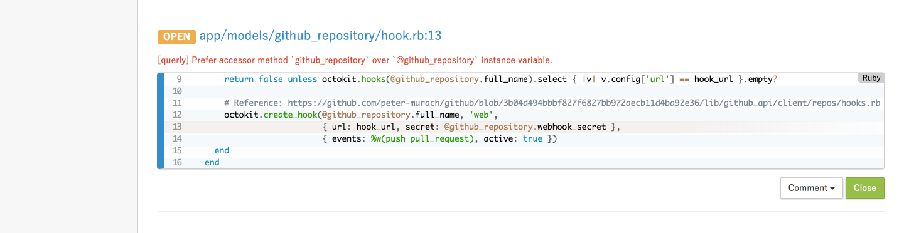
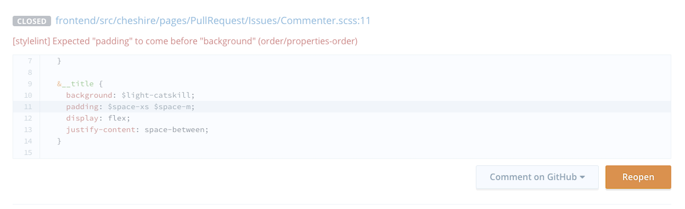
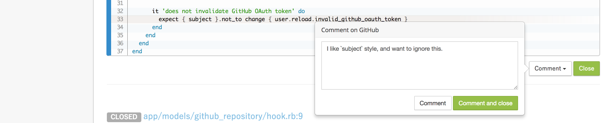

# Working with Issues

Sider finds issues in your pull requests using LINT tools. The tools may detect an issue which does not actually have any problems. Such issues are called _false positives_.

Sider's issue manager allows you to ignore such issues to help your team review your code faster. You don't have to fix the issues to have all the checks passed. You don't have to push a new commit with any magic comments to suppress the LINT's warning.

We believe this feature comes in handy! 💪

## Closing Issues
When you find an issue reported by LINT tools and you are sure it is a false positive, you can close the issue by clicking the `Close` button.



When there is no open issues left in the pull request, the commit status will turn green.


You can _reopen_ the issue after closing it.



Closed issues will still be visible on Sider screen. Your teammates can review the issues later.

## Requesting for Comments
If you are not sure whether the issue is a false positive or not, you can ask your teammates to help you figure it out. Click the `Comment` button to post a comment to GitHub.



You and your teammates can continue the discussion on GitHub.

## Reviewing Closed Issues
If there are any closed (ignored) issues in your pull request, the commit status message will show as follows:

```
No issues left; 3 issues closed.
```

Please carefully review all of the changes and check the issues that were closed on Sider.


If you do not think that the issue can be ignored, click the `Reopen` button and ask the developer to fix it.

## Permission
Sider decides whether to allow users to close issues based on their GitHub permissions. If a user does not have a permission to push a new commit in GitHub, then Sider will not grant them a permission to close any issues.

* If developers have a permission to push commits, Sider will see them as qualified and experienced enough developers to judge which issues can be ignored safely.
* If developers are not allowed to push commits on GitHub, Sider will recongnize them as junior level and restrict the option to close issues.

We believe this brings a good balance of control and flexibility to your team.